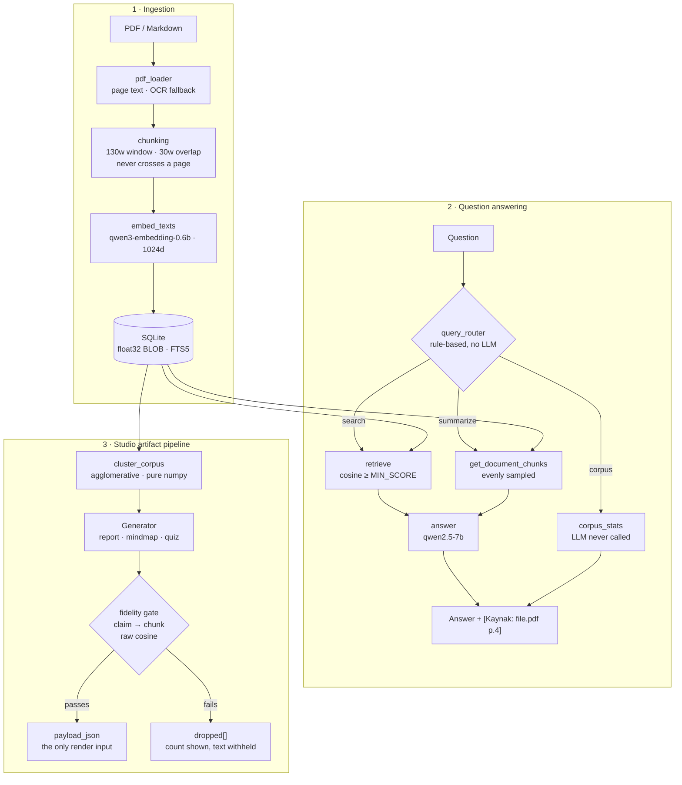

# Local RAG Assistant — fully offline Turkish document Q&A, with every generated sentence bound to a source chunk


-success)


<!-- TODO: Add a license badge once a LICENSE file is chosen and added to the repo root. -->
<!-- TODO: Add a CI status badge once a GitHub Actions workflow runs the gate suite. -->

Built for the **Microsoft Türkiye AI Innovators** program. Runs entirely on
[Foundry Local](https://github.com/microsoft/foundry-local) — no cloud, no API key, no telemetry.

---

## 📌 Problem & Architecture

**Problem.** LLM assistants answer confidently from parametric memory, so an answer looks
identical whether it came from your documents or from the model's imagination. Uploading
private documents to a cloud API is often not an option at all. Both problems are usually
solved separately; here they are one constraint.

**Core solution.** Three enforced properties:

1. **Fully local inference.** Every model call goes through Foundry Local. `eval/offline_proof.py`
   wraps `socket.socket.connect` for a full 23-question evaluation run and records **0 socket calls**
   — a stronger claim than "it worked with Wi-Fi off".
2. **Refusal over invention.** A cosine threshold (`MIN_SCORE = 0.45`) drops off-topic questions
   before the LLM is ever called; the system prompt handles "close topic, no answer".
3. **Generated artifacts are bound to sources.** Reports, mind maps and quizzes are produced by a
   shared pipeline where structure is **deterministic** and the LLM only writes prose/labels.
   Every claim is bound to a chunk with a **raw cosine score**; whatever fails the gate is
   **not published** — its count is shown, its text is withheld.



---

## 🛠️ Tech Stack & Key Components

| Layer | Technology | Purpose |
|---|---|---|
| Runtime | Python 3.13 | Engine, evaluation harness, backend |
| Inference | Foundry Local SDK · `qwen2.5-7b` · `qwen3-embedding-0.6b` | Local chat + embedding models (GPU variants) |
| Retrieval | NumPy · SQLite (FTS5) | L2-normalised matrix cache, cosine search, optional BM25+RRF |
| Storage | SQLite (`float32` BLOB) | Chunks, embeddings, artifacts, claims, quiz attempts |
| OCR | macOS Vision (`pyobjc`) | Scanned-page fallback; `tr-TR` verified at runtime |
| API | FastAPI · SSE | 14 endpoints, streaming chat + artifact generation |
| Frontend | Next.js 16 (`output: 'export'`) · React 19 · Tailwind · shadcn/ui | Static export served by FastAPI — one process, zero network |
| Dev-only | Playwright + Chromium | Browser proof (`requirements-dev.txt`, never imported by the product) |

**Studio artifact pipeline** — one pipeline, three outputs:

| Artifact | Deterministic part | LLM part |
|---|---|---|
| Report | section plan, tables, citations | section prose |
| Mind map | nodes, chunk membership, edges | cluster label only |
| Quiz | 3 of 4 question types, **all distractors** | `short_answer` only |

---

## ⚖️ Engineering Decisions & Trade-Offs

Every decision below was **measured**, not assumed. The full record — including rejected
alternatives and refuted measurements — lives in [`PROJE_DURUMU.md`](PROJE_DURUMU.md) (Turkish).

| Decision | Rationale (measured) |
|---|---|
| `qwen2.5-7b` over `phi-4-mini` | 23/23 vs 12/15. `phi-4-mini` invented answers on **all three** unanswerable questions; both scored 10/10 on retrieval — the failure was generation, not search. |
| `MIN_SCORE` lowered 0.55 → 0.45 | A question whose answer is verbatim in the corpus scored **0.494** and was rejected at 0.55. The threshold had been overfitted to the eval set's phrasing. |
| Hybrid retrieval (BM25+RRF) shipped but **disabled by default** | Measured 23/23 with it off, **22/23** with it on. At 20–40 chunks dense retrieval already finds nearly everything; the feature is complete and tested, to be enabled as the corpus grows. |
| `float32` BLOB, not JSON | A 1024-dim vector is ~20 KB as JSON, **4 KB** as a BLOB. |
| Sampling parameters are **not** used for quality control | Measured: `temperature` 0.0 vs 1.5 produced byte-identical output; different seeds produced identical output. The Foundry Local runtime ignores them — only `max_tokens` is effective. |
| macOS Vision OCR, not a vision-language model | A VLM **generates** text rather than reading it, and can silently fill an unreadable word with a plausible one — fatal for a quoted RAG corpus. |
| Mind map layout hand-written, **no `d3-hierarchy`** | The map is two levels (root → topics); radial layout is ~20 lines of trigonometry. `package.json` never changed. |
| Quiz distractors come from the corpus, never from the LLM | Asking a model for a "plausible but **wrong**" option puts an unverifiable claim into the answer key. A term taken from another cluster is real *and* provably wrong (verified absent from the source chunk). |

**Bottlenecks & constraints**

- **Prefill dominates latency.** First token 4.8–5.9 s, total 5.6–7.6 s per answer. Streaming's real
  win is not speed — it is the Retrieval Inspector filling in **0.04–0.07 s** so the user sees
  which sources were found while the model is still working.
- **16 GB RAM is a hard limit.** Model runs must not overlap. Measured the hard way: launching an
  evaluation run immediately after another model run produced `SIGKILL (137)` twice.
- **Artifact generation costs minutes**, since latency scales with LLM call count
  (report ≈ 9–12 calls). Hence SSE progress is mandatory, not decorative.

---

## 📊 Evaluation & Results

Hardware: **Apple M4 MacBook Air, 16 GB**, macOS 26.5, Foundry Local 0.8.119.

| Gate | Result | Notes |
|---|---|---|
| Evaluation set | **23/23** (172 s, 7.5 s/question) | 10 answerable · 3 unanswerable · 2 edge · 3 meta · 2 corpus · 3 cross-lingual |
| Retrieval accuracy | **10/10** | Correct source document for every answerable question |
| Model comparison | `qwen2.5-7b` 23/23 · `phi-4-mini` 12/15 | `eval/results.json`, reproducible via `--model` |
| Offline audit | **0 socket calls** | `socket.connect` wrapped across a full eval run |
| Backend tests | **201 passing** (~1.5 s) | No model loaded — pure unit/API layer |
| Fidelity gate trap | `0.5487 / grounded` | A **known limit**, pinned so it cannot change silently (see below) |
| Mind map closing proof | **13/13** | 7 clusters, 7/7 labels from the model, `fidelity_score` 1.0000 |
| Quiz closing proof | **16/16** | Answer key verifiable from corpus; injected hallucination **not published** |
| Browser proof | **42/42** | Real Chromium: keyboard navigation, print contract, 0 console errors, 0 external requests |

Reproduce any of them:

```bash
.venv/bin/python eval/run_eval.py          # 23/23
.venv/bin/python eval/offline_proof.py     # 0 sockets, writes eval/OFFLINE_PROOF.md
.venv/bin/python -m pytest backend/tests -q
```

---

## 🚀 Quickstart & Reproducibility

**Prerequisites:** [Foundry Local](https://github.com/microsoft/foundry-local) installed and running.
Models are pulled once by Foundry Local on first use (`qwen2.5-7b` ≈ 5.2 GB).

```bash
git clone https://github.com/engyusufziya/Microsoft-Building-Local-LLM.git
cd Microsoft-Building-Local-LLM
python3 -m venv .venv && source .venv/bin/activate
pip install -r requirements.txt
```

**Ingest documents, then ask:**

```bash
.venv/bin/python -m rag.ingest --pdf your-file.pdf     # or: --markdown-dir data
.venv/bin/python cli.py "RAG kaç adımdan oluşur?"      # single question
.venv/bin/python cli.py --show-chunks                  # interactive, shows retrieved context
```

**Run the web product (FastAPI serves the static frontend — one process):**

```bash
cd web && npm install && npm run build && cd ..
.venv/bin/uvicorn backend.main:app --port 8000         # http://127.0.0.1:8000
```

**Configuration.** No `.env` file is required. Optional environment variables:

| Variable | Effect |
|---|---|
| `RAG_BACKEND_DB_PATH` | Use a different SQLite file (`:memory:` in tests) |
| `RAG_BACKEND_SKIP_WARMUP` | Skip model warmup; `model_status` stays `warming` |
| `NEXT_PUBLIC_API_BASE` | Point the frontend at a separate backend port during development |

All tunable constants live in a single file with their rationale: [`rag/config.py`](rag/config.py).

---

## 📂 Project Structure

```
├── rag/              # Engine (pure business logic, no HTTP)
│   ├── config.py     #   every constant + the measurement behind it
│   ├── retrieve.py   #   cosine search, optional BM25+RRF candidate pool
│   ├── topics.py     #   agglomerative clustering (pure numpy)
│   └── artifacts/    #   pipeline: base · fidelity gate · report · mindmap · quiz
├── backend/          # FastAPI surface (thin: HTTP/SSE, schema mapping, errors)
├── web/              # Next.js static export (chat, inspector, studio views)
├── eval/             # Evaluation set, gates, and one-off closing measurements
├── data/             # Markdown fixtures used by the evaluation set
└── docs/             # FEATURE_SPEC · STUDIO_PLAN · DESIGN_SYSTEM (Turkish)
```

---

## ⚠️ Limitations & Technical Roadmap

Documented rather than hidden — this is the project's core discipline.

**Current limitations**

- **The fidelity gate measures *grounding*, not *entailment*.** A claim that is close to the corpus
  topic but contradicts it ("this system uses GPT-4 and sends data to OpenAI servers") still scores
  `0.5487 / grounded`. Compensated by a second, lexical layer that **removes such claims from the
  published artifact** — the gate's limit is pinned by `eval/fidelity_trap.py` so it cannot drift.
- **Hardware bound:** 16 GB RAM; concurrent model runs will OOM. Foundry Local GPU model variants
  are assumed. <!-- TODO: Confirm behaviour on Windows/CUDA hosts; only macOS/M4 has been measured. -->
- **`expected_keywords` in the evaluation harness reports loosely** (a correct answer can look
  "incomplete" when a keyword does not match verbatim). Deliberately not loosened.
- **Turkish grammar is imperfect** in `qwen2.5-7b` output; one generated label carried an accent typo.
- **Quiz distractor quality** is bounded by the same lexical heuristic the fidelity layer uses;
  ordinary words capitalised mid-sentence can enter the pool.
- **`scope="document"`** (single-document artifacts) works and is tested at the API level, but has
  no UI entry point — the panel always requests corpus-wide artifacts.

**Roadmap**

- CI workflow running the gate suite (`pytest` + frontend build + lint) on every push.
  <!-- TODO: Decide whether model-loading gates (eval, offline proof) run in CI or stay local-only. -->
- Enable hybrid retrieval once the corpus outgrows the scale where dense retrieval dominates.
- Data Table artifact: extract genuine numeric tables from documents (charts are deliberately **not**
  generated from prose — inventing numbers would violate the fidelity principle).
- <!-- TODO: Add a LICENSE file; the repository currently has none. -->
