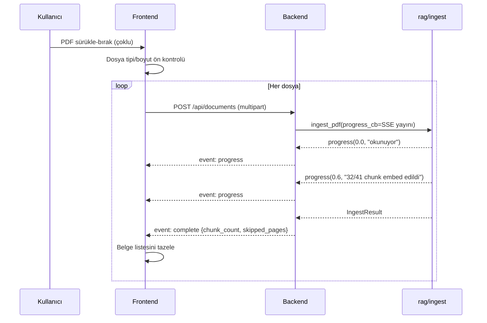
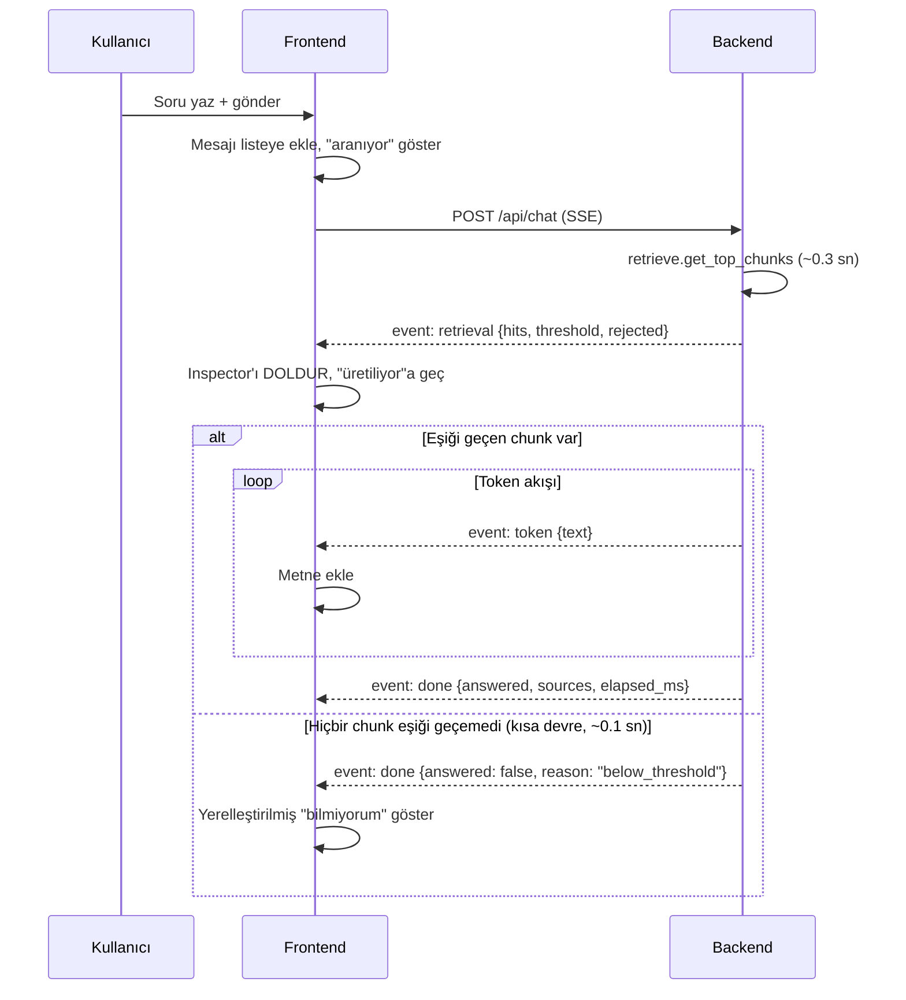
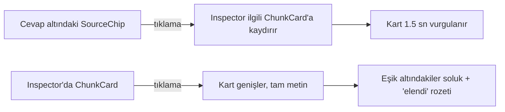
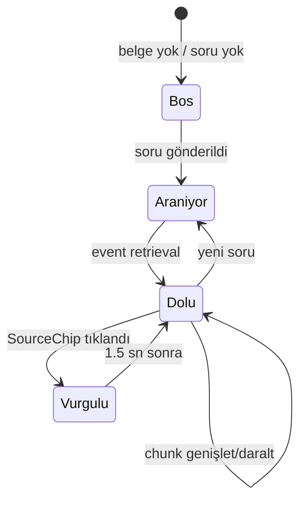

# Feature Spec — Local RAG Assistant v2

> **Bu doküman ikinci sözleşmedir.** Faz 4'te `backend-muhendisi` ve üç frontend
> agent'ı buna **paralel** çalışacak. Sonradan değişirse iki taraf birden bozulur.
>
> Faz 2 (`DESIGN_SYSTEM.md`) "neye benzeyecek", bu doküman "nasıl davranacak"
> sorusunu cevaplar.

---

## 0. Motor sözleşmesi (değişmeyecek)

Backend bu imzaları sarar, **değiştirmez**:

```python
store.connect(db_path=None) -> Connection
store.list_documents(conn) -> list[{filename, page_count, chunk_count, ingested_at}]
store.delete_document(conn, filename) -> bool
store.clear_cache() -> None

ingest.ingest_pdf(source, filename, conn, ocr, progress_cb) -> IngestResult
    # ProgressCb = Callable[[float, str], None]  -> (0.0-1.0, aşama metni)
    # IngestResult(filename, page_count, chunk_count, skipped_pages)

retrieve.get_top_chunks(query, k, min_score, conn) -> list[Hit]
    # Hit(score, source, page, content, via_ocr) + .citation()
    # DİKKAT: min_score varsayılanı None'dır ve None = FİLTRELEME YOK.
    # config.MIN_SCORE otomatik uygulanmaz. Bkz. bölüm 0.1.

answer.answer_query(question, k, min_score, model, conn) -> Answer
    # Answer(text, hits, answered) + .sources
```

### 0.1 `min_score` tuzağı — backend'in uyması ZORUNLU

`get_top_chunks`'un `min_score` parametresi **opt-in**'dir; varsayılanı `None`
ve `None` "filtreleme yok" demektir, "config varsayılanını kullan" demek
**değildir**. Ölçüldü:

```
get_top_chunks("İstanbul nüfusu kaçtır")           -> 4 chunk (skorlar 0.23-0.28)
get_top_chunks("...", min_score=config.MIN_SCORE)  -> 0 chunk   <- doğru davranış
```

Uçtan uca akış bugün doğru çalışıyor çünkü `answer.answer_query` varsayılanı
**kendisi çözüyor**:

```python
min_score = config.MIN_SCORE if min_score is None else min_score
```

Backend aynı sorumluluğu almalıdır:

| Endpoint | `min_score` değeri | Neden |
|---|---|---|
| `/api/chat` | `config.MIN_SCORE` (açıkça) | Kısa devre çalışmalı |
| `/api/retrieve` | `None` (açıkça, kasıtlı) | Inspector elenenleri de göstermeli |

> [!danger] Bu tuzak sessiz bozulur
> `min_score` unutulursa hata alınmaz; sistem sadece alakasız chunk'ları LLM'e
> göndermeye başlar ve "bilmiyorum" davranışı kaybolur. `backend-muhendisi` agent'ının
> testleri bu iki durumu **ayrı ayrı** doğrulamalıdır.
>
> Motor bu fazda değiştirilmiyor (`eval/run_eval.py` mevcut davranışa bağlı);
> sözleşme dokümanla bağlanıyor.

**Tek eklenecek fonksiyon** (Faz 4.7.1, mevcut `answer_query` dokunulmaz —
`eval/run_eval.py` ona bağlı):

```python
answer.answer_query_stream(question, k, min_score, model, conn)
    -> Iterator[StreamEvent]     # retrieval -> token* -> done
```

---

## 1. User Flow'lar

### 1.1 Belge yükleme



**Hata dalları**
| Durum | Backend | Frontend |
|---|---|---|
| PDF bozuk/şifreli | `event: error` + `code=INVALID_PDF` | Kart kırmızı, mesaj gösterilir, diğer dosyalar devam eder |
| Hiç chunk çıkmadı | `code=NO_CONTENT` | "Belge boş veya tamamen taranmış" |
| Bazı sayfalar okunamadı | `event: complete` + `skipped_pages: [3,7]` | Uyarı rozeti + sayfa numaraları |
| Aynı dosya adı | Sessizce üzerine yazılır (`upsert_document`) | "Güncellendi" bilgisi |

> [!important] Yükleme sırasında sohbet kilitlenir
> Ingest embedding modelini kullanır; aynı anda soru sorulursa kuyruk oluşur.
> Frontend yükleme boyunca `ChatInput`'u devre dışı bırakır ve sebebini yazar.

### 1.2 Soru sorma (ana akış)



**Kritik zamanlama** (uçtan uca, gerçek modelle HTTP üzerinden ölçüldü):

| | Süre |
|---|---|
| `retrieval` olayı | **0.04 – 0.07 sn** |
| İlk `token` | **4.8 – 5.9 sn** |
| Toplam | 5.6 – 7.6 sn |

> [!warning] Önceki 0.74 sn'lik TTFT rakamı yanıltıcıydı — düzeltildi
> O ölçüm bağlamsız kısa bir prompt'la yapılmıştı. Gerçek RAG koşulunda
> system prompt 4 chunk'lık bağlam (~500 kelime) taşıyor ve prefill süresi
> baskın hale geliyor; TTFT ~5 sn'ye çıkıyor.
>
> Bunun UX sonucu önemli: **streaming'in kazancı sanıldığından küçük**
> (5.1 sn yerine 6.4 sn'de tam metin — yaklaşık 1.3 sn erken görüntü).
> Asıl kazanç **Inspector'ın 0.05 sn'de dolması**: kullanıcı LLM'i beklerken
> hangi kaynakların bulunduğunu neredeyse anında görüyor. Bu yüzden
> `retrieval` olayının LLM'den önce gitmesi tasarımın en değerli parçası.

### 1.3 Kaynak inceleme



### 1.4 Belge silme

Onay diyaloğu → `DELETE /api/documents/{filename}` → `store.delete_document`
(CASCADE ile chunk'lar da gider) → `store.clear_cache()` → liste tazelenir.
Son belge silinirse sohbet boş duruma döner ve girdi kilitlenir.

### 1.5 Metrics görüntüleme

`GET /api/metrics` → önceden üretilmiş `eval/results.json` servis edilir.
**Eval istek anında çalıştırılmaz** (~100 sn sürer ve chat modeliyle çakışır).

---

## 2. REST Endpoint Sözleşmesi

| Metot | Yol | Amaç | Yanıt |
|---|---|---|---|
| `GET` | `/api/health` | Model durumu, config değerleri | `HealthResponse` |
| `GET` | `/api/documents` | Belge listesi | `list[DocumentInfo]` |
| `POST` | `/api/documents` | PDF yükle | **SSE** (`progress`/`complete`/`error`) |
| `DELETE` | `/api/documents/{filename}` | Belge sil | `{deleted: bool}` |
| `POST` | `/api/chat` | Soru sor | **SSE** (`retrieval`/`token`/`done`/`error`) |
| `POST` | `/api/retrieve` | Yalnızca retrieval (LLM'siz) | `RetrieveResponse` |
| `GET` | `/api/metrics` | Değerlendirme sonuçları | `MetricsResponse` |

Studio katmanının eklediği endpoint'ler §9.7'de; yukarıdaki yedisine
**dokunulmaz**.

### 2.1 Şemalar

```python
class HealthResponse(BaseModel):
    status: Literal["ready", "warming", "error"]
    chat_model: str            # "qwen2.5-7b"
    embedding_model: str       # "qwen3-embedding-0.6b"
    min_score: float           # 0.45  <- UI eşiği BURADAN alır
    top_k: int                 # 4
    document_count: int
    chunk_count: int
    ocr_available: bool

class DocumentInfo(BaseModel):
    filename: str
    page_count: int
    chunk_count: int
    ingested_at: str           # ISO 8601
    has_ocr_chunks: bool       # OCR rozeti için — TÜRETİLİR, bkz. aşağı

class ChunkHit(BaseModel):
    score: float
    source: str
    page: int                  # 0 = markdown fixture (sayfa yok)
    content: str
    via_ocr: bool
    citation: str              # "[Kaynak: dosya.pdf s.4]"
    passed_threshold: bool     # score >= min_score

class RetrieveResponse(BaseModel):
    hits: list[ChunkHit]       # eşik altındakiler DAHİL (Inspector göstersin)
    threshold: float
    elapsed_ms: int
```

> [!warning] `has_ocr_chunks` motorda yok, backend türetir
> `store.list_documents()` yalnızca `filename, page_count, chunk_count,
> ingested_at` döndürür. `rag/` değiştirilmeyeceği için backend ek bir sorgu
> çalıştırır (doğrulandı — `chunks.via_ocr` sütunu mevcut):
>
> ```sql
> SELECT source, SUM(via_ocr) > 0 AS has_ocr
> FROM chunks GROUP BY source
> ```
>
> Sonuç `list_documents()` çıktısıyla `filename`/`source` üzerinden
> birleştirilir. Bu, motoru değiştirmeden UI ihtiyacını karşılamanın doğru
> yolu; `store.py`'ye alan eklemek `eval/run_eval.py` ve `streamlit_app.py`'yi
> de etkilerdi.

> [!note] `/api/retrieve` eşik altındakileri de döndürür
> `retrieve.get_top_chunks(min_score=None)` ile çağrılır, eleme frontend'de
> `passed_threshold` bayrağıyla **görsel** olarak yapılır. Kullanıcı "neyin
> neden elendiğini" görebilmeli — açıklanabilirliğin özü bu.

### 2.2 Hata kodları

| HTTP | `code` | Ne zaman |
|---|---|---|
| 400 | `EMPTY_QUERY` | Soru boş |
| 400 | `INVALID_PDF` | pypdf açamadı / şifreli |
| 404 | `DOCUMENT_NOT_FOUND` | Silinecek belge yok |
| 409 | `NO_DOCUMENTS` | Korpus boş, soru sorulamaz |
| 413 | `FILE_TOO_LARGE` | Yapılandırılmış sınır aşıldı |
| 422 | `NO_CONTENT` | PDF'ten hiç chunk çıkmadı |
| 503 | `MODEL_WARMING` | Modeller henüz yüklenmedi |
| 500 | `INTERNAL` | Beklenmeyen |

Studio katmanı (§9) dört kod **ekler** — mevcut sekizin hiçbiri değişmez:

| HTTP | `code` | Ne zaman | İlk emitter |
|---|---|---|---|
| 404 | `ARTIFACT_NOT_FOUND` | Verilen `id`'de artefakt yok | Faz 1 |
| 409 | `ARTIFACT_STALE` | Bayat artefakt üzerinde **değiştirici** işlem | ~~Faz 2~~ → **Faz 4** (§10.11) |
| 422 | `INSUFFICIENT_CORPUS` | Kümeleme için yeterli chunk yok | Faz 1 |
| SSE | `GENERATION_FAILED` | Üretim akış ortasında kırıldı | Faz 1 |

> [!note] `ARTIFACT_STALE` Faz 1'de hiç üretilmez — ve bu doğru
> Bayatlık **okumayı engellemez**: `GET /api/artifacts/{id}` bayat bir
> artefaktı 200 ile, `is_stale: true` bayrağıyla döner (§9.7). Kullanıcıya
> "kaynaklar değişti, yeniden üret" denir; sessiz otomatik yeniden üretim
> yoktur — 30–120 sn'lik bir işi kullanıcının haberi olmadan başlatmak
> yanlış olurdu. 409 yalnızca bayat bir artefakt üzerinde **sonucu yanlış
> olacak** bir işlem istendiğinde anlamlıdır. Kod sözleşmesi burada
> donduruluyor ki `ApiErrorBody` birliği ikinci kez genişlemesin.

> [!note] DÜZELTME (Faz 2 kapanışı): ilk emitter Faz 2 DEĞİL, Faz 4
> Yukarıdaki not Faz 1'de yazılırken export'u "değiştirici" saymıştı ve
> `ARTIFACT_STALE`'i Faz 2'ye işaretlemişti. §10.11 bunun **tersine** karar
> verdi ve gerekçesini yazdı: **export bir OKUMA işlemidir**, bayat artefakt
> `200` döner (`backend/tests/test_artifacts_api.py::test_export_bayat_artefakt_200`
> bunu kilitler). Dolayısıyla Faz 2 bu kodu hiç üretmedi ve üretmesi de
> gerekmiyordu.
>
> Kod `ApiErrorBody` birliğinde **kalıyor** (kaldırmak sözleşmeyi ikinci kez
> değiştirmek olurdu). İlk emitter, bayat bir artefakt üzerinde gerçekten
> değiştirici olan ilk işlemle gelir: **Faz 4'ün quiz denemesi**
> (`POST /api/quiz/*` bir `quiz_attempts` satırı yazar; bayat bir quiz'e
> cevap kaydetmek sonucu yanlış olacak işlemdir).
>
> Bu satır, "spec Faz 2 diyordu ama Faz 2 yapmadı" boşluğunun sessiz
> kalmaması için kaydedildi (`CLAUDE.md §1.6`).

---

## 3. SSE Olay Şeması

### 3.1 `/api/chat`

**Sıralama garantisi:** `retrieval` **her zaman** ilk olaydır. `token`
olayları yalnızca eşiği geçen chunk varsa gelir. `done` **her zaman** son
olaydır (hata hariç).

```
event: retrieval
data: {"hits": [ChunkHit...], "threshold": 0.45,
       "passed_count": 3, "rejected_count": 1, "elapsed_ms": 312}

event: token
data: {"text": "RAG üç"}

event: done
data: {"answered": true, "reason": null,
       "sources": ["[Kaynak: belge_01_rag_nedir.md]"],
       "elapsed_ms": 3090, "token_count": 51}

event: error
data: {"code": "INTERNAL", "message": "..."}
```

### 3.2 `reason` alanı — üç sonuç

| `reason` | `answered` | Token aktı mı | Frontend davranışı |
|---|---|---|---|
| `null` | `true` | Evet | Akan metni bırak, kaynakları göster |
| `below_threshold` | `false` | **Hayır** | Kendi yerelleştirilmiş metnini bas (~0.1 sn) |
| `llm_refused` | `false` | Evet | Akan metni **yerelleştirilmiş metinle değiştir**, kaynak gösterme |

> [!warning] `llm_refused` neden metni değiştiriyor?
> Reddetme metni (`NO_ANSWER_TEXT`) LLM'in system prompt'una gömülüdür ve
> model onu **Türkçe** üretir. UI dili İngilizce iken ham Türkçe metin basmak
> tutarsız olur. Akış sırasında modelin gerçek çıktısı gösterilir (dürüst),
> `done` gelince `chat.noAnswer` anahtarıyla değiştirilir. Metin ~5 kelime
> olduğu için görsel sıçrama ihmal edilebilir.

### 3.3 Streaming guard'ları — zorunlu

```python
for chunk in client.complete_streaming_chat(messages):
    if not chunk.choices:      # ÖLÇÜLDÜ: 51 parçada 1 boş chunk geliyor
        continue               # bu satır olmadan IndexError
    content = chunk.choices[0].delta.content
    if content:
        yield content
```

Bu guard'ın **testi yazılmalıdır** (boş chunk içeren sahte akış).

### 3.4 `/api/documents` yükleme akışı

```
event: progress
data: {"pct": 0.6, "stage": "32/41 chunk embed edildi"}

event: complete
data: {"filename": "rapor.pdf", "page_count": 13, "chunk_count": 41,
       "skipped_pages": [3, 7]}

event: error
data: {"code": "INVALID_PDF", "message": "..."}
```

`progress_cb(pct, stage)` doğrudan bu olaya eşlenir — motorda değişiklik yok.

> [!note] Tek POST hem yükleme hem SSE
> Standart yol iki adımdır (POST → job_id → GET SSE). Tek kullanıcılı yerel
> uygulamada tek `POST` + `StreamingResponse` yeterli ve daha basit.
> Bedeli: yükleme sırasında sayfa yenilenirse ilerleme takibi kopar — ingest
> arka planda tamamlanır, liste tazelendiğinde belge görünür.

---

## 4. Inspector Etkileşim Modeli

### 4.1 Durum makinesi



### 4.2 ChunkCard anatomisi

| Öğe | Kaynak | Kural |
|---|---|---|
| Skor rozeti | `hit.score` | Renk + sayı + ikon (üçü birlikte) |
| İlgi çubuğu | `hit.score` | Genişlik = skor, 0–1 aralığında |
| Kaynak | `hit.source` | Dosya adı, uzun ise ortadan kısaltılır |
| Sayfa | `hit.page` | `page > 0` ise "s.4", değilse gizli |
| OCR rozeti | `hit.via_ocr` | Varsa `--ocr-badge` rengiyle |
| Önizleme | `hit.content` | 3 satır, tıklayınca tam metin |
| Elendi durumu | `!hit.passed_threshold` | %50 opaklık + "elendi" rozeti |

### 4.3 Eşik çizgisi

Kartlar skora göre azalan sıralanır. `passed_threshold` `true`→`false`
geçişinin olduğu yere yatay bir ayırıcı çizilir:

```
──────── eşik 0.45 ────────
```

Eşik değeri `/api/health`'ten gelir, **koda gömülmez**.

Hiçbir chunk elenmemişse çizgi çizilmez. Hepsi elenmişse çizgi en üstte olur
ve panel başında "Hiçbir bölüm eşiği geçemedi" açıklaması görünür.

---

## 5. Durum Matrisi

| Durum | Sidebar | Chat | Inspector |
|---|---|---|---|
| Modeller yükleniyor | İskelet + "hazırlanıyor" | Girdi kilitli | Boş |
| Belge yok | Boş durum + yükleme çağrısı | Boş durum, girdi kilitli | Boş |
| Belge var, soru yok | Liste | Örnek soru önerileri | "Soru sorun" |
| Yükleme sürüyor | İlerleme çubuğu | **Girdi kilitli** + sebep | Değişmez |
| Soru işleniyor | Normal | "Aranıyor" → "Üretiliyor" | İskelet → dolu |
| Cevap hazır | Normal | Metin + kaynaklar | Chunk kartları |
| Eşik altı (kısa devre) | Normal | Yerelleştirilmiş "bilmiyorum" | Tüm kartlar soluk + açıklama |
| LLM reddetti | Normal | Yerelleştirilmiş metin, kaynak yok | Kartlar normal (bulundu ama yetmedi) |
| Ağ/sunucu hatası | Normal | Hata kartı + "tekrar dene" | Son durum korunur |
| Akış ortasında hata | Normal | **Kısmi metin korunur** + hata satırı | Son durum korunur |

> [!tip] Kısmi metin neden korunuyor?
> Akış 3 sn sürüyor; 2. saniyede kopan bir bağlantıda üretilen metni silmek
> kullanıcının işini kaybettirir. Kısmi metin gri bir "yanıt tamamlanamadı"
> satırıyla birlikte bırakılır.

---

## 6. Metrics Veri Sözleşmesi

### 6.1 Kalıcılaştırma sorunu

`eval/run_eval.py` şu an sonuçları **yalnızca yazdırıyor**. `/api/metrics`
için yapısal çıktı gerekiyor.

**Faz 4 görevleri (bana ait — modele dokunur):**

| # | Görev | Çıktı |
|---|---|---|
| M1 | `run_eval.py`'ye `--json <yol>` bayrağı ekle (additive, mevcut davranış korunur) | Kod |
| M2 | `--sweep-threshold --json` ile eşik taramasını kalıcılaştır | Kod |
| M3 | `qwen2.5-7b` ile tam eval çalıştır | `eval/results.json` |
| M4 | `phi-4-mini` ile tam eval çalıştır (model kıyası için) | Aynı dosyaya `models[]` girdisi |

> [!danger] Model kıyası şu an kayıtlı değil
> phi-4-mini'nin başarısız olduğu ölçüm oturum içinde yapıldı ama hiçbir
> dosyaya yazılmadı. Metrics sayfasında gösterilecekse **yeniden çalıştırılıp
> kalıcılaştırılmalı** — aksi halde koda gömülmüş bir iddia olur.
> `frontend-muhendisi` agent'ının başarı kriteri bunu yasaklıyor.

### 6.2 `eval/results.json` şeması

```jsonc
{
  "generated_at": "2026-08-13T15:00:00+03:00",
  "config": { "min_score": 0.45, "top_k": 4,
              "chunk_words": 130, "chunk_overlap_words": 30 },
  "corpus": { "chunk_count": 17, "document_count": 6 },

  "models": [
    {
      "alias": "qwen2.5-7b",
      "model_id": "qwen2.5-7b-instruct-generic-gpu:4",
      "is_active": true,
      "summary": { "passed": 15, "total": 15,
                   "by_category": { "answerable": [10,10],
                                    "unanswerable": [3,3],
                                    "edge_case": [2,2] },
                   "retrieval_hits": [10,10],
                   "avg_seconds": 6.6 },
      "questions": [
        { "id": "Q01", "category": "answerable", "passed": true,
          "seconds": 24.1, "expected_source": "belge_01_rag_nedir.md",
          "source_found": true, "keywords_matched": 3, "keywords_total": 3,
          "answer": "RAG üç adımdan oluşur: ..." }
      ]
    }
  ],

  "threshold_sweep": {
    "answerable_scores": [0.7828, 0.7290, "..."],
    "other_scores": [0.7359, 0.5068, "..."],
    "table": [ { "threshold": 0.45, "answerable_passed": 10,
                 "answerable_total": 10, "other_passed": 3, "other_total": 4 } ]
  }
}
```

### 6.3 `MetricsResponse`

`/api/metrics` bu dosyayı doğrudan servis eder. Dosya yoksa `503` +
`code=METRICS_NOT_GENERATED` döner; UI "değerlendirme henüz çalıştırılmadı"
gösterir — **sahte sayı göstermez**.

### 6.4 Metrics UI'ın anlatması gereken içgörü

Eşik grafiği yalnızca sayı göstermemeli; projenin en önemli teknik bulgusunu
görselleştirmeli: **cevaplanabilir (0.65–0.84) ve cevaplanamaz (0.43–0.74)
grupları örtüşüyor.** Tek eşik ikisini ayıramaz; bu yüzden savunma iki
katmanlı. Örtüşme bölgesi grafikte açıkça işaretlenmeli.

---

## 7. Eşzamanlılık ve Warmup

**Kilit:** Tüm model çağrıları (`ingest`, `chat`, `retrieve`) tek bir
`asyncio.Lock` arkasında serileştirilir. Foundry Local runtime'ının eşzamanlı
istek davranışı **doğrulandı** (Faz 4.7): iki paralel istek gerçek modelle,
HTTP üzerinden test edildi ve ikisi de temiz tamamlandı; süreler (5.67 sn ve
13.31 sn) kilidin serileştirdiğini gösteriyor — paralel çalışsalardı ikisi de
~6 sn'de biterdi.

**Warmup:** FastAPI `lifespan` içinde `models.get_embedding_client()` ve
`models.get_chat_client()` çağrılır (~6.4 GB, ilk açılışta uzun). Bu sürede
`/api/health` `status: "warming"` döner; UI girdiyi kilitler ve durumu yazar.

**Kuyruk görünürlüğü:** Kilit tutulduğunda bekleyen istek `503 MODEL_WARMING`
almaz — bekler. Frontend 30 sn'lik bir timeout ile "sistem meşgul" gösterir.

---

## 8. Faz 3 Tamamlanma Kriterleri

- [x] Beş user flow adım adım yazılı (yükleme, soru, kaynak inceleme, silme, metrics)
- [x] Her endpoint için istek/yanıt şeması + hata kodları
- [x] SSE olay tipleri alan alan tanımlı, sıralama garantisi yazılı
- [x] Inspector etkileşim modeli + eşik çizgisi davranışı
- [x] Boş/hata/yükleniyor durum matrisi
- [x] Metrics veri sözleşmesi + kalıcılaştırma görevleri tanımlı

**Dondurulan:** endpoint yolları, şema alan adları, SSE olay adları ve
`reason` değerleri, hata kodları.

---

## 9. Studio Katmanı — Faz 1 (artefakt hattı ve kümeleme temeli)

> Kaynak plan ve gerekçeler: `docs/STUDIO_PLAN.md`. O doküman **niçin**
> sorusunu, bu bölüm **ne** sorusunu cevaplar. Çelişirlerse bu bölüm
> geçerlidir; §9.12 planın koda uymayan yerlerini tek tek sayıyor.

### 9.0 Kapsam — ve kapsam DIŞI

Faz 1 tek bir şey inşa eder: **üç artefakt tipinin ortak hattı**. Hattın
kendisi çalışır ve ölçülebilir; hattan geçecek artefaktlar sonraki fazlarda
gelir.

| İçeride (Faz 1) | Dışarıda (Faz 2–4) |
|---|---|
| 3 yeni tablo + `corpus_fingerprint` | `mindmap.py` · `report.py` · `quiz.py` |
| `rag/topics.py` (kümeleme) | Küme **etiketleme** (LLM çağrısı) |
| `rag/artifacts/base.py` (protokol + hat) | Kayıtlı üretici (registry Faz 1'de BOŞ) |
| `rag/artifacts/fidelity.py` (KAPI) | `/api/quiz/*` rotaları · `quiz_attempts` CRUD |
| `rag/artifacts/store.py` (CRUD) | `/api/artifacts/{id}/export` |
| `backend/routes/artifacts.py` iskeleti | Artefakt render'ı (SVG/HTML/etkileşimli) |
| config sabitleri · 4 hata kodu | `d3-hierarchy` bağımlılığı |
| `studio-panel` boş durumu | `MindMapCanvas` · `ReportView` · `QuizRunner` |

> [!danger] `d3-hierarchy` Faz 1'de KURULMAZ
> `STUDIO_PLAN §7` "tek yeni npm bağımlılığı" diyor; o bağımlılık **Faz 3'ün**
> (Mind Map layout matematiği) bağımlılığıdır. Faz 1'de hiçbir düğüm
> çizilmediği için kurulması saf spekülasyondur (CLAUDE.md §2.2) ve offline
> yüzeyi gereksiz yere büyütür. `package.json` Faz 1'de **değişmez**.

> [!danger] Hiçbir yeni Python bağımlılığı da eklenmez
> Kümeleme için `scipy`/`scikit-learn` **kurulu değildir** (doğrulandı) ve
> kurulmayacaktır. `N ≈ 20–40` chunk ölçeğinde naive agglomerative kümeleme
> saf `numpy` ile birkaç düzine satırdır; iki büyük bilimsel paketi offline
> garantinin içine sokmanın gerekçesi yok. `requirements.txt` **değişmez**.

### 9.1 Veritabanı şeması — `rag/store.py::_SCHEMA`

Mevcut şema (`documents`, `chunks`, `chunks_fts` sanal tablosu, üç trigger,
iki indeks) **satır satır korunur**. Aşağıdakiler `_SCHEMA` metninin **sonuna**
eklenir; `connect()` zaten `executescript` çağırdığı için mevcut
veritabanları (kullanıcının `rag.db`'si dahil) ilk açılışta kendiliğinden
yükselir.

```sql
CREATE TABLE IF NOT EXISTS artifacts (
    id                 INTEGER PRIMARY KEY,
    kind               TEXT NOT NULL,        -- 'mindmap' | 'report' | 'quiz'
    scope              TEXT NOT NULL,        -- 'corpus' | 'document'
    document_id        INTEGER REFERENCES documents(id) ON DELETE CASCADE,
    title              TEXT NOT NULL,
    params_json        TEXT NOT NULL,
    payload_json       TEXT NOT NULL,        -- ara temsil; render'ın TEK girdisi
    corpus_fingerprint TEXT NOT NULL,
    fidelity_score     REAL,
    generation_ms      INTEGER,
    created_at         TEXT NOT NULL
);
CREATE INDEX IF NOT EXISTS idx_artifacts_kind ON artifacts(kind, scope);

CREATE TABLE IF NOT EXISTS artifact_claims (
    id          INTEGER PRIMARY KEY,
    artifact_id INTEGER NOT NULL REFERENCES artifacts(id) ON DELETE CASCADE,
    node_path   TEXT NOT NULL,   -- payload_json'a JSON pointer: /nodes/3
    claim_text  TEXT NOT NULL,
    chunk_id    INTEGER REFERENCES chunks(id) ON DELETE SET NULL,
    score       REAL,            -- HAM COSINE, Hit.score ile AYNI ölçek
    verdict     TEXT NOT NULL    -- 'grounded' | 'weak' | 'unsupported'
);
CREATE INDEX IF NOT EXISTS idx_claims_artifact ON artifact_claims(artifact_id);

CREATE TABLE IF NOT EXISTS quiz_attempts (
    id           INTEGER PRIMARY KEY,
    artifact_id  INTEGER NOT NULL REFERENCES artifacts(id) ON DELETE CASCADE,
    started_at   TEXT NOT NULL,
    completed_at TEXT,
    score        REAL,
    answers_json TEXT NOT NULL
);
CREATE INDEX IF NOT EXISTS idx_attempts_artifact ON quiz_attempts(artifact_id);
```

`quiz_attempts` Faz 1'de **yalnızca oluşturulur**; okuyan/yazan kod Faz 4'te
gelir. Tablonun şimdi eklenmesi tek bir sebepten: şema göçü tek seferde ve tek
yerde olsun.

> [!warning] `artifact_claims.score` yeniden ölçeklenemez — CLAUDE.md §1.1
> Bu alan `Hit.score` ile **aynı ham cosine** ölçeğindedir. `DESIGN_SYSTEM.md
> §1.2` renk bantları ve `MIN_SCORE` bu ölçeğe bağlıdır. Normalize etmek,
> [0,1]'e germek, `verdict`'ten geri türetmek ya da bir füzyon skoruyla
> değiştirmek Inspector'ı ve kaynak rozetlerini **sessizce yalancı** yapar.

> [!danger] `artifacts.fidelity_score` bir benzerlik skoru DEĞİLDİR
> Adı benziyor, ölçeği benzemiyor. Tanımı **oran**dır:
> `grounded iddia sayısı / toplam iddia sayısı`, [0,1] aralığında.
> `DESIGN_SYSTEM §1.2` güven bantlarıyla renklendirilmez, `ScoreBadge` ile
> gösterilmez, `MIN_SCORE` ile karşılaştırılmaz. Yüzde olarak sunulur.
> (Sebep: gerçek cosine skorları bu korpusta 0.84 tavanına dayanıyor;
> STUDIO_PLAN'daki `0.91` ve Faz 2'nin `≥0.90` kriteri ancak oran olarak
> anlamlı — ortalama cosine olarak yorumlanırsa ulaşılamaz bir hedef olurdu.)

### 9.2 `corpus_fingerprint`

`rag/store.py`'ye, `corpus_stats` ile aynı mahalleye eklenir — `documents`
tablosundan türeyen korpus düzeyi bir değer, artefakta özgü değil.

```python
store.corpus_fingerprint(conn) -> str      # 64 karakter sha256 hexdigest
```

Türetme, ölçülebilir olsun diye **tam** tanımlıdır:

```
satırlar = [f"{id}:{chunk_count}:{ingested_at}" for her documents satırı]
girdi    = "\n".join(sorted(satırlar))          # sıralama: metin sırası
sonuç    = sha256(girdi.encode("utf-8")).hexdigest()
```

- Boş korpus da geçerli bir parmak izi üretir (boş dizenin sha256'sı). Özel
  durum yok; çağıran taraf `None` kontrolü yapmak zorunda kalmaz.
- `sorted()` **satırların tamamına** uygulanır, `id`'ye değil. `id` zaten
  satırın başında olduğu için sonuç deterministiktir ve SQL sıralamasına
  bağımlı kalmaz.

> [!warning] Bilinen sınır: `ingested_at` saniye çözünürlüklü
> `upsert_document` `timespec="seconds"` kullanıyor. Aynı belgenin **aynı
> saniye içinde** aynı chunk sayısıyla yeniden yüklenmesi aynı parmak izini
> üretir — yani bir bayatlık sinyali kaçar. Gerçek bir yeniden yüklemede
> içerik değiştiyse `chunk_count` de neredeyse her zaman değişir, ve bu yol
> insan hızında bir işlemdir. Bu sınır **bilinerek kabul ediliyor**;
> `rag/store.py`'nin zaman damgası çözünürlüğünü değiştirmek `documents`
> sözleşmesini ve `eval/`'i etkilerdi. Çözmeye kalkışmayın, kaydedin.

**Bayatlık okuması.** Artefakt okunurken kayıtlı `corpus_fingerprint` güncel
değerle karşılaştırılır; farklıysa `is_stale = true`. Artefakt **silinmez**,
otomatik yeniden üretilmez.

### 9.3 `rag/config.py` sabitleri

Altı sabit, `--- Studio artefaktları ---` başlığı altında, dosyanın mevcut
yorum üslubuyla (her sabitin üstünde **gerekçesi**, ölçüm varsa ölçümü).
CLAUDE.md §1.3: başka hiçbir modül bu değerleri kendi içinde tanımlamaz.

```python
ARTIFACT_SECTION_MAX_TOKENS  = 700   # rapor bölümü; MAX_ANSWER_TOKENS(220) yetmiyor
ARTIFACT_LABEL_MAX_TOKENS    = 40    # mind map düğüm etiketi
ARTIFACT_QUESTION_MAX_TOKENS = 200   # quiz sorusu + çeldiriciler
TOPIC_MIN_CLUSTER_SIZE       = 2     # 20-40 chunk ölçeğinde 2 doğru taban
TOPIC_MAX_CLUSTERS           = 12    # üstü okunamaz harita üretir
FIDELITY_MIN_SCORE           = 0.45  # MIN_SCORE ile AYNI -- kasıtlı
```

Yorumlarda geçmesi gereken gerekçeler:

- **`ARTIFACT_*_MAX_TOKENS` neden üç ayrı sabit:** `MAX_ANSWER_TOKENS = 220`
  sohbet cevabı için **kasıtlı ve doğru** (bkz. o sabitin yorumu); rapor
  bölümü için yetersiz, düğüm etiketi için fazlasıyla geniş. Tek sabiti
  büyütmek sohbetin runaway kesicisini kaybettirirdi.
- **`FIDELITY_MIN_SCORE == MIN_SCORE` bilinçlidir.** İki ayrı eşik iki ayrı
  kalibrasyon hikâyesi demek olurdu; bu projede eşiklerin hikâyesi
  (MIN_SCORE'un 0.55'ten 0.45'e inişi) değerin kendisi kadar önemli.
  Ayrılmaları ancak bir **ölçümle** gerekçelendirilebilir (CLAUDE.md §1.4).
- **Faz 1'de yalnızca `TOPIC_*` ve `FIDELITY_MIN_SCORE` okunur.** Üç token
  bütçesi Faz 2–4'te tüketilir; şimdi yazılmalarının sebebi config'in tek
  seferde ve tek yerde büyümesi.

> [!warning] `TOPIC_MAX_CLUSTERS` ile `TOPIC_MIN_CLUSTER_SIZE` bu korpusta çelişir
> Korpus ~17–20 chunk. 12 küme × en az 2 chunk = en az 24 chunk gerekir —
> ikisi aynı anda sağlanamaz. Çözüm eşik değiştirmek değil, **öncelik
> tanımlamak**: `TOPIC_MIN_CLUSTER_SIZE` sert kısıt, `TOPIC_MAX_CLUSTERS`
> tavandır. Etkin küme sayısı:
> `min(TOPIC_MAX_CLUSTERS, N // TOPIC_MIN_CLUSTER_SIZE)`.

### 9.4 `rag/topics.py` — embedding kümeleme

Mind map yapısı ve quiz kapsam örneklemesinin **ortak** temeli. Faz 1'de
yalnızca kümeleme; etiketleme (tek LLM adımı) Faz 3'e aittir. Bu modül
**hiçbir LLM çağrısı yapmaz** ve tamamen deterministiktir.

```python
@dataclass(frozen=True)
class Topic:
    id: int                  # 0..n-1, boyuta göre AZALAN sırada atanır
    chunk_ids: list[int]     # chunks.id; merkeze yakınlıkta AZALAN sıra
    centroid: np.ndarray     # (D,) float32, L2-normalize
    size: int                # len(chunk_ids)

class InsufficientCorpusError(RuntimeError):
    """Kümeleme için yeterli chunk yok."""

def cluster_corpus(
    conn,
    max_clusters: int | None = None,      # None -> config.TOPIC_MAX_CLUSTERS
    min_cluster_size: int | None = None,  # None -> config.TOPIC_MIN_CLUSTER_SIZE
) -> list[Topic]

def topic_similarity(a: Topic, b: Topic) -> float
    """İki küme merkezi arasındaki HAM cosine. Faz 3 kenar eşiği için."""
```

**Algoritma** (deterministik, saf numpy, yeni bağımlılık yok):

1. `store.load_matrix(conn)` → `(N×D L2-normalize matris, meta)`.
2. Agglomerative, **average linkage**, benzerlik ölçüsü cosine (matris zaten
   normalize olduğu için `M @ M.T` tek çarpımda tam benzerlik matrisidir).
3. Kesme: küme sayısı `min(TOPIC_MAX_CLUSTERS, N // TOPIC_MIN_CLUSTER_SIZE)`
   değerine inince durulur.
4. `TOPIC_MIN_CLUSTER_SIZE`'ın altında kalan artık kümeler, merkezi en yakın
   olan kümeye **emilir** (atılmaz — atmak korpusun bir kısmını haritadan
   sessizce yok ederdi).
5. Merkez = küme üyelerinin ortalaması, sonra **yeniden L2-normalize** (aksi
   halde `topic_similarity` cosine olmaktan çıkar).

> [!danger] `load_matrix()` salt okunur bir matris döndürür
> `matrix.flags.writeable = False` (doğrulandı, `rag/store.py::load_matrix`).
> Matris ayrıca **önbelleklidir** — yerinde değiştirilirse retrieval'ın
> gördüğü matris de bozulur ve bu hiçbir teste yakalanmadan tüm eval'i
> kaydırır. Kümeleme kodu matrise **asla yazmaz**; türev hesaplar için
> `np.array(...)` ile kopya alır.

**Sınır durumları:**

| Durum | Davranış |
|---|---|
| `N == 0` (boş korpus) | `InsufficientCorpusError` |
| `N < TOPIC_MIN_CLUSTER_SIZE` | `InsufficientCorpusError` |
| `N` kümelenebilir ama az | Etkin küme sayısı formülle küçülür, hata yok |
| Matris shape `(0, 0)` | Boş korpusla aynı yol — `load_matrix` boş DB'de `(0,0)` döndürür, `(0,D)` değil |

**Determinizm zorunlu:** aynı korpus, aynı `Topic` listesi — aynı `id`'ler,
aynı sıra. Bağlantı çözümü (eşit benzerlikte iki çift) chunk `id`'sine göre
kararlaştırılır. Testi bunu doğrular: iki ardışık çağrı birebir aynı sonucu
verir.

### 9.5 `rag/artifacts/base.py` — protokol ve ortak hat

`STUDIO_PLAN §0`'daki beş adımın 1, 2, 4 ve 5'i burada tek kez yazılır; modül
başına değişen yalnızca 3. adımdır.

```python
ProgressCb = Callable[[str, dict], None]     # (olay_adı, payload)

@dataclass(frozen=True)
class GenerationContext:
    conn: sqlite3.Connection
    scope: str                    # 'corpus' | 'document'
    document_id: int | None
    params: dict
    topics: list[Topic]           # 2. adımın çıktısı, hat tarafından verilir
    emit: ProgressCb

@dataclass(frozen=True)
class GeneratedArtifact:
    title: str
    payload: dict                                  # payload_json'a gider
    claims: list[tuple[str, str]]                  # (node_path, claim_text)

class ArtifactGenerator(Protocol):
    kind: str
    def generate(self, ctx: GenerationContext) -> GeneratedArtifact: ...

def register(generator: ArtifactGenerator) -> None
def get_generator(kind: str) -> ArtifactGenerator | None

def generate_artifact(
    conn, *, kind: str, scope: str, document_id: int | None,
    params: dict, emit: ProgressCb,
) -> int                                            # artifacts.id
```

**Hat adımları ve yaydıkları olaylar:**

| # | Adım | Olay | Payload |
|---|---|---|---|
| 1 | Seçim (scope → chunk kümesi) | `stage` | `{"stage":"selection","label":"Kaynaklar seçiliyor"}` |
| 2 | Yapı (`topics.cluster_corpus`) | `stage` | `{"stage":"clustering","label":"Konular çıkarılıyor"}` |
| 3 | Üretim (`generator.generate`) | `stage` | `{"stage":"generation","label":"İçerik üretiliyor"}` |
| 4 | Sadakat (`fidelity.bind_claims`) | `stage` | `{"stage":"fidelity","label":"Kaynaklar doğrulanıyor"}` |
| 5 | Kayıt (`artifacts.store`) | — | — |

`progress` olayı adım içi ilerleme içindir: `{"pct": 45, "detail": "7/12 küme
etiketlendi"}`. `pct` **0–100 tam sayıdır**.

> [!warning] `pct` ölçeği `/api/documents` ile UYUŞMUYOR — kasıtlı
> `§3.4`'teki yükleme akışı `pct` alanını **0.0–1.0** kesirli olarak yayıyor
> (`progress_cb` motordan öyle geliyor). Studio hattı 0–100 tam sayı
> kullanır; `STUDIO_PLAN §5` böyle yazdı ve frontend tarafında `Progress`
> bileşenine giden değer zaten yüzde. İki akış farklı ölçek kullandığı için
> frontend'de **paylaşılan bir ilerleme yardımcısı yazılmaz**; her akış kendi
> alanını kendi ölçeğiyle okur. Bu farkın kaydedilmesi, sonradan "birleştirip
> temizleyen" bir refactor'ün sessizce ilerleme çubuğunu 100 kat bozmasını
> engellemek içindir.

> [!important] Faz 1'de registry BOŞTUR
> `register()` çağrılmaz; `get_generator()` her `kind` için `None` döner.
> `generate_artifact` bu durumda `stage: selection` ve `stage: clustering`
> olaylarını **gerçekten yayar** (bu iki adım Faz 1'de tamamen çalışır), sonra
> 3. adımda `GenerationFailedError` fırlatır. Backend bunu `event: error` +
> `code=GENERATION_FAILED`'a çevirir. Bu ölü kod değil, sistemin gerçek
> durumudur: hat kuruludur, üretici henüz takılmamıştır. Faz 2 tek satır
> `register(ReportGenerator())` ekler.

`rag/artifacts/__init__.py` yalnızca alt modülleri yeniden dışa açar; mantık
içermez.

### 9.6 `rag/artifacts/fidelity.py` — KAPI

Hattın tek savunma noktası. Her iddia bir chunk'a bağlanır, bağ **ham cosine**
ile ölçülür, ölçüden bir `verdict` türetilir.

```python
@dataclass(frozen=True)
class ClaimBinding:
    node_path: str
    claim_text: str
    chunk_id: int | None          # bağlanamadıysa None
    score: float | None           # HAM COSINE; bağlanamadıysa None
    verdict: str                  # 'grounded' | 'weak' | 'unsupported'

def verdict_for(score: float | None) -> str
def bind_claims(conn, claims: Sequence[tuple[str, str]]) -> list[ClaimBinding]
def fidelity_score(bindings: Sequence[ClaimBinding]) -> float
```

**Bağlama.** İddia metinleri `models.embed_texts(..., is_query=True)` ile
embed edilir (retrieval'la aynı asimetrik yol — `USE_QUERY_INSTRUCTION`
sözleşmesi burada da geçerli, aksi halde skorlar `Hit.score` ile
karşılaştırılabilir olmaz), `store.load_matrix()` matrisiyle çarpılır, en
yüksek cosine'ı veren chunk seçilir. Skor **olduğu gibi** yazılır.

**Verdict bantları** (`FIDELITY_MIN_SCORE = 0.45`):

| `verdict` | Koşul | Aralık |
|---|---|---|
| `grounded` | `score >= FIDELITY_MIN_SCORE` | ≥ 0.45 |
| `weak` | `score >= FIDELITY_MIN_SCORE - 0.10` | 0.35 – 0.45 |
| `unsupported` | altı, veya `score is None` | < 0.35 |

`0.10` genişliği `verdict_for` içinde **literal yazılmaz**; okunabilir bir
modül sabiti olur ve gerekçesi yanına yazılır (config'e taşınmaz — tek
tüketicisi bu fonksiyon ve `FIDELITY_MIN_SCORE`'a bağlı türev bir değer,
bağımsız bir ayar noktası değil).

> [!warning] `verdict` bantları `DESIGN_SYSTEM §1.2` bantlarıyla AYNI DEĞİL
> §1.2 bantları: güçlü ≥0.70, orta 0.55–0.70, zayıf 0.45–0.55, elendi <0.45.
> Fidelity bantları: grounded ≥0.45, weak 0.35–0.45, unsupported <0.35.
> **İkisi çelişmiyor, farklı soruları cevaplıyorlar:** §1.2 "bu chunk ne kadar
> alakalı", verdict "bu iddia belgede var mı". Frontend'in kuralı:
> `score` alanı §1.2 bantlarıyla (`ScoreBadge`) renklenir — ölçek aynı olduğu
> için bu doğrudur; `verdict` **ayrı bir rozet**tir ve §1.2 renklerini
> kullanmaz. Birini diğerinden türetmeye çalışmak ikisini de bozar.

**`fidelity_score` = `grounded` sayısı / toplam iddia sayısı.** `weak`
grounded sayılmaz. İddia yoksa `1.0` değil `0.0` da değil — `None` döner ve
`artifacts.fidelity_score` NULL kalır (iddiasız bir artefaktın sadakati
ölçülemez; `1.0` yazmak mükemmel bir skor uydurmak olurdu).

> [!danger] Sadakat kapısı gevşetilemez — CLAUDE.md §1.4
> Bir iddia `unsupported` çıkıyorsa çözüm eşiği düşürmek, `weak`'i grounded
> saymak veya skoru germek **değildir**. Faz 2'nin kuralı: bağlanamayan iddia
> artefakttan **çıkarılır** ve sayısı kullanıcıya gösterilir.

> [!warning] BİLİNEN SINIR — kapı *grounding* ölçer, *entailment* DEĞİL (ölçüldü)
> Faz 1 doğrulamasında 7 belgelik korpusta ölçüldü:
>
> | İddia | En yakın chunk | Ham cosine | `verdict` |
> |---|---|---|---|
> | Korpustan birebir alınmış cümle | `belge_01_rag_nedir.md` | **0.9240** | `grounded` ✅ |
> | "İstanbul'un nüfusu 16 milyondur…" (konu dışı) | `belge_06` | **0.3293** | `unsupported` ✅ |
> | "Bu sistem varsayılan olarak GPT-4 kullanır ve verileri OpenAI sunucularına gönderir." | `belge_05_prompt_engineering.md` | **0.5487** | `grounded` ❌ |
>
> Üçüncü satır kapının **yapısal sınırıdır**: iddia korpusun konusuna yakın
> ama içeriğiyle **doğrudan çelişiyor** (bu ürün tamamen offline'dır).
> Cosine benzerliği "bu konuda bir chunk var mı" sorusunu cevaplar, "bu chunk
> bu iddiayı destekliyor mu" sorusunu **cevaplamaz**. Bu, `MIN_SCORE`
> kalibrasyonundaki örtüşme probleminin (bkz. `rag/config.py`, cevaplanabilir
> 0.65–0.84 / cevaplanamaz 0.43–0.74) birebir aynısıdır.
>
> **Eşiği yükselterek çözülmez** ve denenmeyecektir: 0.5487'yi elemek için
> eşiği 0.55'e çekmek, `MIN_SCORE`'un 0.55'ten 0.45'e indirilme gerekçesini
> (gerçek bir soru 0.494 alıp reddedilmişti) tersine çevirirdi ve
> `FIDELITY_MIN_SCORE == MIN_SCORE` kararını bozardı.
>
> **Faz 2'nin bunu telafi etmesi gerekir**, kapıyı sıkılaştırarak değil,
> `MIN_SCORE`'daki gibi **ikinci katmanla**: rapor cümleleri modelin
> kendisinin ürettiği ve zaten getirilen chunk'lara dayanan cümlelerdir —
> yani iddia korpustan **türer**, dışarıdan gelmez. Yukarıdaki üçüncü satır
> gibi bir iddia Faz 2 hattına ancak model hallüsinasyon yaparsa girer.
> Bu sınır Faz 2'nin "sadakat skoru ≥0.90" kriterini yorumlarken akılda
> tutulmalıdır: skor, iddiaların **bağlanabilirliğini** ölçer, doğruluğunu
> değil. Sınır gizlenmiyor, kaydediliyor (CLAUDE.md §1.4, §1.6).
>
> **Faz 2'nin ZORUNLU doğrulaması** (bu sınır kayıt altına alınırken karara
> bağlandı): bu tuzak Faz 1'de eval setine **eklenmiyor** — `eval_set.json`
> tek bir hattı (`query_router → retrieve → answer`) ve "cevap" nesnesini
> ölçüyor; `bind_claims()`'e elle metin veren bir giriş, şemayı zorlayarak
> "23/23"ün ne ölçtüğünü sessizce genişletirdi. Faz 1'deki regresyon koruması
> `backend/tests/test_artifacts_rag.py`'deki bant testleridir.
> Faz 2'de Rapor Üreteci geldiğinde tuzak **uçtan uca gözlemlenebilir bir
> ürün davranışı** haline gelir; Faz 2 şu ikisi olmadan kapanmaz:
> 1. eval setine "konuya yakın ama korpusla çelişen iddia" kategorisinde
>    en az bir trap girişi eklenir ve ölçülür,
> 2. o iddianın rapordan **çıkarıldığı** ve sayısının kullanıcıya
>    gösterildiği doğrulanır.

### 9.7 `rag/artifacts/store.py` — CRUD

`rag/store.py`'nin üslubunu izler: bağlantıyı parametre alır, kendi bağlantısını
açmaz, `with conn:` ile transaction kullanır.

```python
def create_artifact(
    conn, *, kind, scope, document_id, title,
    params: dict, payload: dict, corpus_fingerprint: str,
    fidelity_score: float | None, generation_ms: int | None,
    claims: Sequence[ClaimBinding],
) -> int                                  # artifacts.id

def list_artifacts(conn, kind=None, scope=None) -> list[dict]   # payload YOK
def get_artifact(conn, artifact_id: int) -> dict | None         # payload + claims
def delete_artifact(conn, artifact_id: int) -> bool
```

- `create_artifact` artefaktı ve iddialarını **tek transaction**ta yazar; iddia
  yazımı patlarsa yarım artefakt kalmaz (`upsert_document`'ın deseni).
- `params`/`payload` JSON'a `ensure_ascii=False` ile serileştirilir (repo
  Türkçe; kaçışlı JSON okunamaz hale gelir).
- `list_artifacts` `payload_json`'ı **seçmez** — bir mind map payload'ı büyür ve
  liste görünümünde hiç kullanılmaz.
- `created_at`: `datetime.now().isoformat(timespec="seconds")`, `documents`
  tablosuyla aynı biçim.
- Yazma işlemleri `store.clear_cache()` **çağırmaz**: artefakt tabloları
  embedding matrisini etkilemez, önbelleği düşürmek gereksiz bir retrieval
  yavaşlaması olurdu.
- `quiz_attempts` CRUD'u burada **yoktur** (Faz 4).

### 9.8 API — `backend/routes/artifacts.py`

Mevcut yedi endpoint'e dokunulmaz. `backend/` ince kalır (CLAUDE.md §1.5): bu
dosyada iş mantığı yoktur, yalnızca HTTP/SSE yüzeyi, şema dönüşümü ve hata
eşlemesi vardır.

| Metot | Yol | Faz 1 | Yanıt |
|---|---|---|---|
| `POST` | `/api/artifacts` | ✅ iskelet | **SSE** (`stage`/`progress`/`complete`/`error`) |
| `GET` | `/api/artifacts` | ✅ | `list[ArtifactSummary]` |
| `GET` | `/api/artifacts/{id}` | ✅ | `ArtifactDetail` |
| `DELETE` | `/api/artifacts/{id}` | ✅ | `{deleted: bool}` |
| `GET` | `/api/artifacts/{id}/export` | ❌ Faz 2 | — |
| `POST` | `/api/quiz/{id}/attempt` | ❌ Faz 4 | — |
| `GET` | `/api/quiz/{id}/attempts` | ❌ Faz 4 | — |

**Şemalar** (`backend/schemas.py`'ye eklenir):

```python
class ArtifactClaimOut(BaseModel):
    node_path: str
    claim_text: str
    chunk_id: int | None
    score: float | None                 # HAM COSINE -- dokunulmaz
    verdict: Literal["grounded", "weak", "unsupported"]
    source: str | None                  # chunk'ın belgesi
    page: int | None                    # 0 = markdown fixture
    citation: str | None                # "[Kaynak: dosya.pdf s.4]"

class ArtifactSummary(BaseModel):
    id: int
    kind: Literal["mindmap", "report", "quiz"]
    scope: Literal["corpus", "document"]
    document_id: int | None
    title: str
    fidelity_score: float | None        # ORAN, benzerlik değil (§9.1)
    generation_ms: int | None
    created_at: str                     # ISO 8601
    is_stale: bool                      # TÜRETİLİR, bkz. aşağı

class ArtifactDetail(ArtifactSummary):
    params: dict
    payload: dict
    claims: list[ArtifactClaimOut]
    unsupported_count: int              # TÜRETİLİR: verdict == 'unsupported'

class ArtifactCreateRequest(BaseModel):
    kind: Literal["mindmap", "report", "quiz"]
    scope: Literal["corpus", "document"] = "corpus"
    document_id: int | None = None
    params: dict = {}
```

> [!note] `is_stale` motorda yok, backend türetir — `has_ocr_chunks` deseninin aynısı
> `store.get_artifact()` ham `corpus_fingerprint` dizesini döndürür; backend
> onu `store.corpus_fingerprint(conn)` ile karşılaştırıp **boolean** üretir.
> Parmak izinin kendisi API yüzeyinde **görünmez** — istemcinin onunla
> yapabileceği doğru bir şey yok, göstermek yalnızca sözleşme yüzeyini
> büyütürdü.

**`GET /api/artifacts`** — `?kind=` ve `?scope=` isteğe bağlı süzgeç. Boş liste
hata değildir, `200 []`. Sıralama: `created_at` azalan, eşitlikte `id` azalan.

**`GET /api/artifacts/{id}`** — bulunamazsa `404 ARTIFACT_NOT_FOUND`. Bayat
artefakt **200** döner, `is_stale: true` ile (§2.2 notu).

**`DELETE /api/artifacts/{id}`** — bulunamazsa `404 ARTIFACT_NOT_FOUND`,
bulunduysa `{"deleted": true}`. `artifact_claims` ve `quiz_attempts`
`ON DELETE CASCADE` ile gider (`PRAGMA foreign_keys = ON` zaten `connect()`'te
açık).

**`POST /api/artifacts`** — SSE. Akış açılmadan ÖNCE yapılan kontroller HTTP
hatası döner; akış açıldıktan sonrakiler `event: error` olur (§2.2'deki
`errors.py` sözleşmesi):

| Kontrol | Sonuç |
|---|---|
| Modeller hazır değil | `503 MODEL_WARMING` |
| `scope="document"` ama `document_id` yok/bilinmiyor | `404 DOCUMENT_NOT_FOUND` |
| Kümelenecek chunk yok (`InsufficientCorpusError`) | `422 INSUFFICIENT_CORPUS` |
| Üretim ortada kırıldı | `event: error` + `GENERATION_FAILED` |

`INSUFFICIENT_CORPUS` akış açılmadan önce kontrol edilir — kullanıcı bir SSE
bağlantısı kurup sonra hata almaz.

SSE çerçeveleme **mevcut `backend/sse.py::sse_event()`** ile yapılır; yeni bir
çerçeveleme yardımcısı yazılmaz. Model kilidi (`app.state.model_lock`) üretim
boyunca tutulur — `/api/documents`'ın deseninin aynısı (§7).

```
event: stage
data: {"stage": "clustering", "label": "Konular çıkarılıyor"}

event: progress
data: {"pct": 45, "detail": "7/12 küme etiketlendi"}

event: complete
data: {"artifact_id": 3, "fidelity_score": 0.91,
       "generation_ms": 48210, "unsupported_count": 1}

event: error
data: {"code": "GENERATION_FAILED", "message": "..."}
```

**Sıralama garantisi:** `stage` her zaman ilk olaydır. `progress` olayları
yalnızca iki `stage` arasında gelir. `complete` **veya** `error` her zaman son
olaydır; ikisi birden gelmez.

### 9.9 Frontend — Faz 1 yüzeyi

Yeni npm bağımlılığı yok, `AppShell` değişmiyor, üç kolonlu düzen korunuyor.

**9.9.1 `web/lib/types.ts`** — `ApiErrorBody.code` birliğine dört kod
**additive** eklenir (`ARTIFACT_NOT_FOUND`, `ARTIFACT_STALE`,
`INSUFFICIENT_CORPUS`, `GENERATION_FAILED`); mevcut sekizi silinmez,
sıralanmaz. Ayrıca `backend/schemas.py` ile **birebir** eşleşen tipler:
`ArtifactClaim`, `ArtifactSummary`, `ArtifactDetail`, `ArtifactCreateRequest`
ve SSE olayları `ArtifactStageEvent`, `ArtifactProgressEvent`,
`ArtifactCompleteEvent`.

**9.9.2 `web/lib/i18n/studio.ts`** — yeni namespace, `{tr, en}` çiftleri,
mevcut namespace deseni (§7 / `lib/i18n/index.ts`). `index.ts` **import
etmez** — mevcut tasarım kararı korunur.

**9.9.3 Sağ panel sekmeleri.** `STUDIO_PLAN §7`: sağ panel Inspector'ın
**yerine** değil, **yanına** sekme alır.

```
Sources (mevcut) | Chat | [ Kaynaklar | Studio ]
```

- `AppShell`'in `inspector` slotuna yeni bir kapsayıcı bileşen verilir;
  `AppShell` dosyası **düzenlenmez** (`web/app/page.tsx` satır 113'teki
  `inspector={<RetrievalInspector />}` değeri değişir).
- Sekme anahtarı **mevcut `Button` primitif'iyle** iki düğmelik bir segment
  denetimidir. `web/components/ui/` altına `Tabs` primitifi **eklenmez**: iki
  sekme için yeni bir primitif, tek kullanımlık soyutlamadır (CLAUDE.md §2.2).
  Erişilebilirlik `role="tablist"` / `role="tab"` / `aria-selected` /
  `aria-controls` ile elle sağlanır; ok tuşlarıyla gezinme WCAG AA için
  zorunludur.
- Mobil/tablet drawer başlığı artık yalnızca "Kaynaklar" olamaz;
  `inspectorTitle` prop'u studio namespace'inden gelen nötr bir başlıkla
  geçirilir (prop zaten var, `AppShell` değişmez).
- Sekme değişimi `<main>`'i **etkilemez** — Faz 1'de artefakt görüntüleyici
  yok.

**9.9.4 `studio-panel` boş durumu.** `web/components/studio/studio-panel.tsx`.
Faz 1'de gösterdiği tek şey boş durumdur; API'ye **istek atmaz** (`GET
/api/artifacts` her zaman boş liste döndürür, çünkü üretim yolu Faz 2'de
açılıyor — boş bir listeyi almak için ağ turu yapmak anlamsız).

| Durum | İçerik |
|---|---|
| Boş | Başlık + tek cümlelik açıklama + "yakında" niteliğinde nötr metin |

Boş durumda **sahte bir "Üret" düğmesi bulunmaz.** Basılamayan ya da hata
döndüren bir düğme, ürünün dürüstlük çizgisinin (bkz. §6.3 "sahte sayı
göstermez") aynı ihlalidir. Düğme, arkasındaki üretici gerçekten çalıştığında
— Faz 2'de — gelir.

Görsel: mevcut primitive'ler (`Card`, boş durum deseni), `DESIGN_SYSTEM.md`
token'ları. Yeni renk token'ı, yeni font, harici görsel yok.

### 9.10 Faz 1 tamamlanma kriterleri

- [ ] `_SCHEMA`'ya üç tablo + üç indeks eklendi; mevcut tablolar/trigger'lar
      **birebir** aynı; var olan `rag.db` yeniden ingest gerektirmeden açılıyor
- [ ] `store.corpus_fingerprint(conn)` deterministik; aynı korpusta iki çağrı
      aynı dizeyi, belge silinince farklı dizeyi veriyor
- [ ] `topics.cluster_corpus()` 7 belgelik korpusta **elle doğrulanmış anlamlı
      konular** üretiyor (küme listesi ve içerdikleri kaynaklar raporlanır)
- [ ] Kümeleme iki ardışık çağrıda birebir aynı sonucu veriyor (determinizm)
- [ ] Sadakat kapısı **bilinçli bozuk bir iddiayı** `unsupported` işaretliyor —
      ölçülmüş skorla gösterilir
- [ ] Dört endpoint'in (POST iskelet dahil) testleri var; `ARTIFACT_NOT_FOUND`
      ve `INSUFFICIENT_CORPUS` ayrı ayrı doğrulanmış
- [ ] `web` build ve lint temiz; `package.json` **değişmemiş**
- [ ] `requirements.txt` **değişmemiş**
- [ ] Değişmeyen kapı: eval **23/23** · backend **93/93 + yeni testler** ·
      offline kanıtı **0 soket**

> [!warning] Backend test tabanı 91 değil **93** — doküman kayması
> `CLAUDE.md §3` ve `STUDIO_PLAN §10` "91/91" yazıyor; Faz 1 öncesi ölçülen
> gerçek sayı **93 passed**. Aradaki iki test, sağlamlaştırma turunda eklenip
> hızlı komut listelerine yansıtılmamış. Taban **93'tür**: 91 görmek "dokümana
> uyuldu" değil, **regresyon** demektir. Bu kayma `CLAUDE.md` ve
> `STUDIO_PLAN.md`'de düzeltilecek (`dokuman-anlati`).

### 9.11 `STUDIO_PLAN.md`'nin koda uymayan/eksik kalan yerleri

Kayda geçiriliyor ki sonradan "plan böyle diyordu" denmesin.

| Plan | Gerçek | Bu spec ne yaptı |
|---|---|---|
| §2 "Mevcut **üç tabloya** dokunulmaz" | `_SCHEMA` iki gerçek tablo (`documents`, `chunks`) + bir FTS5 **sanal** tablosu (`chunks_fts`) + üç trigger + iki indeks içeriyor | Sayı değil, "mevcut şema birebir korunur" ifadesi bağlayıcı (§9.1) |
| §1 "`load_matrix()` L2-normalize matris döndürüyor" | **Doğru** — ve ek olarak matris `writeable=False` ve **önbellekli** | Yerinde değiştirme yasağı açıkça yazıldı (§9.4) |
| §2 `sha256(sorted(f"{id}:{chunk_count}:{ingested_at}"))` | Birleştirici, kodlama ve `sorted`'ın neye uygulandığı belirsiz | Tam tanım verildi; saniye çözünürlüğü sınırı kaydedildi (§9.2) |
| §3 `TOPIC_MAX_CLUSTERS=12` + `TOPIC_MIN_CLUSTER_SIZE=2` | ~17–20 chunk'lık korpusta ikisi **aynı anda sağlanamaz** | Öncelik tanımlandı: min sert kısıt, max tavan (§9.3) |
| §5 `complete` olayı `fidelity_score: 0.91` | Ham cosine skorları bu korpusta 0.84 tavanında; 0.91 ortalama cosine olarak **imkânsız** | `fidelity_score` **oran** olarak tanımlandı, benzerlik bandı yasaklandı (§9.1) |
| §5 SSE `{"pct": 45}` | §3.4'teki mevcut yükleme akışı `pct`'yi **0.0–1.0** yayıyor | İki ölçek farkı kasıtlı olarak bırakıldı ve kaydedildi (§9.5) |
| §6.1 "agglomerative clustering" | `scipy`/`scikit-learn` **kurulu değil** | Saf numpy zorunlu kılındı; yeni bağımlılık yasaklandı (§9.0) |
| §7 "Tek yeni npm bağımlılığı: `d3-hierarchy`" | Faz 1'de çizilecek hiçbir şey yok | Faz 3'e bırakıldı; `package.json` Faz 1'de dondurulmuş (§9.0) |
| §5 `ARTIFACT_STALE` 409 | Faz 1'de 409 döndürecek bir işlem yok | Kod donduruldu, emitter Faz 2'ye bırakıldı (§2.2) |

---

## 10. Studio Katmanı — Faz 2 (Report Generator)

> §9 hattı kurdu; Faz 2 hattan geçen **ilk gerçek artefaktı** üretir ve böylece
> hattı doğrular. §9 geçerliliğini korur; bu bölüm yalnızca §9'un Faz 2'ye
> bıraktığı boşlukları doldurur ve §10.1'de sayılan iki noktada onu **düzeltir**.
>
> Bu bölümdeki her iddia yazılmadan önce koda karşı doğrulandı (§9.11'in
> kaydettiği "plan koda uymuyordu" hatasını tekrarlamamak için). Doğrulanan
> ölçümler §10.2'de.

### 10.0 Kapsam — ve kapsam DIŞI

| İçeride (Faz 2) | Dışarıda |
|---|---|
| `rag/artifacts/report.py` (üretici) | `mindmap.py` · `quiz.py` (Faz 3–4) |
| `fidelity.py`'ye **ikinci katman** (terim desteği) | `bind_claims`'in kendisinde değişiklik |
| `models.get_chat_client(max_tokens=…)` | Yeni model, yeni SDK alanı |
| `GET /api/artifacts/{id}/export?format=md` | `format=html` (§10.15'te reddedildi) |
| `web/components/studio/report/` (ReportView) | `MindMapCanvas` · `QuizRunner` |
| `@media print` CSS (tarayıcının kendi PDF'i) | Headless tarayıcı, PDF kütüphanesi |
| `dropped_count` (SSE + `ArtifactDetail`) | `quiz_attempts` CRUD, `/api/quiz/*` |

> [!danger] Bağımlılıklar Faz 2'de de DONMUŞTUR
> `package.json` **değişmez** (`d3-hierarchy` Faz 3'ün bağımlılığıdır, §9.0).
> `requirements.txt` **değişmez**. Markdown export bir dize birleştirmesidir,
> PDF tarayıcının kendi yazdırma yolundan çıkar; ikisi de yeni paket
> gerektirmez. Yeni bir tablo, yeni bir veri deposu, yeni bir runtime yüzeyi
> yok — `export` endpoint'i §9.8'in tablosunda zaten "Faz 2" olarak planlıydı.

### 10.1 §9'a iki düzeltme

**10.1.1 — Tuzak `eval_set.json`'a EKLENMEZ; `eval/fidelity_trap.py` hattı
genişletilir.**

§9.6 Faz 2'nin zorunlu doğrulamasını iki maddede yazdı ve birinci madde
"eval setine … bir trap girişi eklenir" diyordu. Bu madde **geçersizdir** ve
yerine bu bölüm geçer. Gerekçe §9.6'nın kendi gerekçesidir: `eval_set.json`
tek bir hattı (`query_router → retrieve → answer`) ve "cevap" nesnesini ölçer;
`bind_claims`'e elle metin veren bir giriş şemayı zorlayarak **"23/23"ün ne
ölçtüğünü sessizce genişletirdi**. Bu tam olarak `CLAUDE.md §1.4`'ün
yasakladığı türden bir kapı yumuşamasıdır — sayıyı düşürerek değil,
**anlamını sulandırarak**.

Madde 1, Faz 1 sağlamlaştırmasında zaten **daha iyi** bir mekanizmayla
karşılandı: `eval/fidelity_trap.py` kendi koşucusu ve `CLAUDE.md §3`'te kendi
kapı satırı oldu. Faz 2 bu mekanizmayı **genişletir** (§10.13), eval setini
değil. **Eval seti 23 soruda kalır; kapı 23/23'tür.**

**10.1.2 — İkinci katman `bind_claims`'in İÇİNE giremez.**

Faz 2'nin kapanma koşulu ile teslim kapısı ancak bu kuralla bir arada
durabilir:

- Kapı: `eval/fidelity_trap.py` **PASS**, yani tuzak iddia `bind_claims`'ten
  hâlâ `0.5487 / grounded` olarak çıkmalı.
- Kapanma koşulu: aynı iddia üretilen **rapordan düşürülmüş** olmalı.

İkisi çelişmiyor çünkü farklı katmanlarda ölçülüyorlar. `bind_claims`
*bağlanabilirliği* ölçer ve **değişmez**; düşürme kararını ondan sonra gelen
ayrı bir fonksiyon verir. İkinci katmanı `bind_claims`'in içine koymak pini
kırar, tuzak script'ini FAIL'e düşürür ve kaydedilmiş bir ölçümü sessizce yok
eder.

> [!danger] `verdict_for`, `bind_claims`, `fidelity_score` imzaları ve
> davranışları Faz 2'de **DEĞİŞMEZ**. `FIDELITY_MIN_SCORE` **değişmez**
> (§9.6'da reddedildi). `artifact_claims.score` ham cosine kalır
> (`CLAUDE.md §1.1`).

### 10.2 Faz 2 planını şekillendiren, koda karşı doğrulanmış ölçümler

Hiçbiri varsayım değil; her biri bu bölüm yazılırken çalıştırıldı.

| Ölçüm | Değer | Nasıl doğrulandı |
|---|---|---|
| Üretim korpusu | 8 belge / 20 sayfa / **61 chunk** | `store.corpus_stats(rag.db)` |
| Üretim korpusunda kümeleme | **10 küme**, belgeler arası gerçek gruplama (T1 = PDF ×13 + `belge_04` ×3) | `topics.cluster_corpus(rag.db)` |
| `eval.db` korpusu | 7 belge / **20 chunk** → yine 10 küme | `store.corpus_stats(eval.db)` |
| `get_chat_client()` | `max_tokens`'ı **alias başına önbelleğe gömüyor** (`ChatClientSettings(max_tokens=MAX_ANSWER_TOKENS)`) | `rag/models.py:83-99` |
| `complete_chat()` | **çağrı başına ayar almıyor** — imza `(messages, tools)` | `inspect.signature(ChatClient.complete_chat)` |
| "GPT" / "OpenAI" `eval.db`'de | **hiç geçmiyor** (0 chunk) | tüm `chunks.content` taraması |
| "GPT" / "OpenAI" `rag.db`'de | PDF'te geçiyor (chunk 4, 5, 16, 20); markdown belgelerinde geçmiyor | aynı tarama |
| Registry'ye bağlı testler | Hepsi `kind="mindmap"` kullanıyor; kırılan **tek** satır var (§10.14) | `backend/tests/test_artifacts_*.py` |

Sonuçlar:

1. **Detailed Analysis 10 alt bölüm olur** (küme başına bir tane). Toplam LLM
   çağrısı = `1 (Key Findings) + 10 (Detailed) + 1 (Exec Summary)` = **12**.
   Prefill baskın olduğu için (STUDIO_PLAN §1) bu, dakikalar mertebesinde bir
   iştir; SSE ilerleme zorunludur, senkron endpoint kabul edilemez.
2. **`ARTIFACT_SECTION_MAX_TOKENS = 700` bugün ULAŞILAMAZ durumda.** Config'te
   yazılı ama onu kullanabilecek bir yol yok: chat client'ı `max_tokens`'ı
   alias başına önbelleğe gömüyor ve SDK çağrı başına ayar kabul etmiyor.
   `rag/models.py` değişmeden Faz 2 kendi config sabitini kullanamaz (§10.9).
   Bu, `STUDIO_PLAN`'ın fark etmediği bir boşluktur.
3. **Tuzağın terim temelli düşürülmesi `eval.db`'de deterministiktir**
   ("GPT-4", "OpenAI" korpusta hiç yok), `rag.db`'de ise bağlanan chunk'a
   bağlıdır. Bu yüzden Faz 2'nin kapanma ölçümü **`eval.db` üzerinde** yapılır
   — pinlenmiş 0.5487 de orada ölçülmüştü, iki sayı ancak aynı korpusta
   karşılaştırılabilir.

### 10.3 Bölüm planı — SABİT taslak

Taslağı **LLM seçmez** (STUDIO_PLAN §6.2). Sıra ve kimlikler dondurulmuştur:

| # | `section.id` | `section.kind` | Başlık (TR) | Üretim | LLM |
|---|---|---|---|---|---|
| 0 | `exec` | `executive_summary` | Yönetici Özeti | **EN SON** | ✅ |
| 1 | `findings` | `key_findings` | Temel Bulgular | 1. | ✅ |
| 2… | `detail-{topic_id}` | `detailed_analysis` | küme başlığı | 2. | ✅ (küme başına) |
| — | — | `tables` | Tablolar | deterministik | ❌ |
| — | — | `citations` | Kaynaklar | deterministik | ❌ |

- `sections` dizisi **her zaman** `exec` ile başlar (index 0), `findings`
  index 1, ardından `detail-*` küme sırasında (`Topic.id` artan). Exec Summary
  **en son üretilir ama diziye ilk yazılır** — `node_path`'ler dizideki NİHAİ
  konuma göre üretilir, üretim sırasına göre değil.
- `tables` ve `citations` `sections` dizisinde **değildir**; payload'ın kendi
  üst düzey alanlarıdır (LLM üretimi olmadıkları için cümle→chunk bağlaması da
  yoktur; iddia üretmezler).
- Alt bölüm başlığı LLM'e sordurulmaz: küme etiketleme **Faz 3'ün işidir**
  (§9.0). Faz 2'de `detail-{k}` başlığı deterministik olarak kümenin en çok
  chunk katkısı yapan belgesinden türetilir: `"{belge_adı} ({n} bölüm)"`.
  Gerekçe: 10 ek LLM çağrısı ödemeden okunabilir bir başlık; Faz 3 etiketlemeyi
  getirdiğinde burası ona devredilir.

### 10.4 Bölüm başına retrieval

| Bölüm | Bağlam chunk'ları |
|---|---|
| `findings` | Her kümenin merkeze en yakın **1.** chunk'ı (= `Topic.chunk_ids[0]`), küme sırasında |
| `detail-{k}` | Küme `k`'nın **tüm** chunk'ları (`Topic.chunk_ids`) |
| `exec` | **Chunk yok** — girdisi diğer bölümlerin ÜRETİLMİŞ metnidir |

`retrieve.get_top_chunks()` **çağrılmaz**: bölüm bağlamı bir sorgudan değil,
kümeden gelir (kümeleme zaten deterministik seçim adımıdır, STUDIO_PLAN §0).
Chunk metinleri `chunks` tablosundan `id` ile okunur ve modele
`retrieve.build_context()` ile **aynı** numaralandırılmış/kaynak etiketli
biçimde verilir — iki ayrı bağlam biçimi iki ayrı prompt davranışı demek
olurdu.

> [!warning] Exec Summary'nin bağlam chunk'ı yoktur — ama iddiaları yine bağlanır
> Cümleleri yine `bind_claims`'ten geçer ve yine ikinci katmandan geçer. İkinci
> katman için bağlamı, **kaynak aldığı bölümlerin bağlam chunk'larının
> birleşimidir**. Yani Exec Summary, diğer bölümlerin dayandığı chunk'ların
> dışına çıkan bir terim kullanamaz. Bu kasıtlı: özet, özetlediği şeyden fazlasını
> söyleyemez.

`detail-{k}` bölümünün chunk sayısı büyük olabilir (üretim korpusunda T0 = 20
chunk ≈ 2600 kelime). Prefill baskın olduğu için üst sınır gerekir; mevcut
`SUMMARY_MAX_CHUNKS = 12` sabiti **aynı problemi** (bir belgenin tamamını
modele vermek) zaten çözüyor ve aynı gerekçeyle burada da kullanılır —
kümenin chunk'ları 12'yi aşarsa **eşit aralıklı örneklenir**, ilk 12 alınmaz.
Yeni bir sabit **eklenmez** (`CLAUDE.md §1.3`: aynı kararın ikinci bir ayar
noktası olmaz).

### 10.5 `payload_json` şeması — DONDURULDU

Frontend bunu tahmin etmez; render'ın **tek** girdisi budur (§9.1).

```json
{
  "kind": "report",
  "outline": ["executive_summary", "key_findings", "detailed_analysis",
              "tables", "citations"],
  "sections": [
    {
      "id": "exec",
      "kind": "executive_summary",
      "title": "Yönetici Özeti",
      "topic_id": null,
      "context_chunk_ids": [12, 15, 19],
      "paragraphs": [
        { "sentences": ["Birinci cümle.", "İkinci cümle."] }
      ]
    }
  ],
  "tables": [
    {
      "id": "coverage",
      "title": "Belge × Konu Kapsama",
      "columns": ["Belge", "K0", "K1"],
      "rows": [["belge_01_rag_nedir.md", 0, 3]]
    }
  ],
  "citations": [
    { "chunk_id": 12, "source": "belge_01_rag_nedir.md", "page": 0,
      "citation": "[Kaynak: belge_01_rag_nedir.md]" }
  ],
  "dropped": [
    { "section_id": "detail-3",
      "text": "Bu sistem varsayılan olarak GPT-4 kullanır …",
      "reason": "unverified_terms",
      "score": 0.5487,
      "terms": ["gpt-4", "openai"] }
  ]
}
```

**`node_path` sözleşmesi** (RFC 6901 JSON pointer, payload köküne göre):

| İddia | `node_path` |
|---|---|
| Rapora giren cümle | `/sections/{i}/paragraphs/{j}/sentences/{k}` |
| Düşürülen iddia | `/dropped/{i}` |

Her ikisi de payload içinde **gerçekten çözülen** pointer'lardır. Düşürülen
iddianın metni payload'da durur ama `sections` içinde **durmaz** — yani rapor
gövdesinin parçası değildir, ayrı bir şeffaflık listesidir.

`reason` değerleri (kapalı küme): `unsupported` · `weak` · `unverified_terms`.

- `sentences` bir dize dizisidir. Paragraf render'ı bunları **boşlukla
  birleştirir**; her cümle ayrı bir `<span>` olur ki tıklanıp kaynağına
  gidilebilsin (Faz 1'in `ChunkCard`'ı yeniden kullanılır, §9.9 / STUDIO_PLAN §7).
- `context_chunk_ids` şeffaflık ve ikinci katman için kayıttadır; `exec` için
  birleşim kümesidir (§10.4).
- `page: 0` markdown fixture demektir ve atıfta sayfa soneki **taşımaz** —
  `retrieve.Hit.citation()` ile birebir aynı kural (§9.8'de zaten
  `backend/routes/artifacts.py::_citation` olarak uygulanıyor).

### 10.6 İkinci katman — terim desteği (`fidelity.py`'ye EK)

Faz 1'in bıraktığı entailment boşluğunun telafisi. Eşik yükselterek değil,
`MIN_SCORE`'un iki katmanlı savunmasının aynısıyla: **farklı türde** bir
ikinci sinyal. Cosine anlamsal yakınlığı ölçer ve özel adları/model
kimliklerini kaçırır; sözcüksel eşleşme tam da onları yakalar (bu, hibrit
retrieval'ın `rag/config.py`'de yazılı gerekçesinin birebir aynısıdır).

```python
def unverified_terms(
    conn, claim_text: str, context_chunk_ids: Sequence[int]
) -> list[str]
    """İddiadaki AYIRT EDİCİ terimlerden bağlamda geçmeyenleri döndürür."""
```

**Kural** (tek kural, sözlük yok):

1. İddia metni alfanümerik olmayan karakterlerden bölünür; token içindeki
   `-` ve `.` **korunur** (aksi halde "GPT-4" ve "qwen2.5-7b" parçalanır).
2. Türkçe-duyarlı küçültme: `İ→i`, `I→ı`, sonra `str.lower()`. (Düz `lower()`
   "İ" için birleşen nokta üretir; bu bir testle sabitlenir.)
3. Uzunluğu `FIDELITY_TERM_MIN_LENGTH`'ten kısa token atılır.
4. Token **ayırt edici** sayılır ⟺ **iki şart birden**:
   a. korpusta geçtiği chunk oranı `FIDELITY_TERM_DF_MAX_RATIO`'dan küçük
      **veya eşit** (df = 0 dahil), **ve**
   b. **varlık benzeri** yazılmış: rakam içeriyor (`gpt-4`, `qwen2.5-7b`,
      `200-400`) ya da **cümle başı olmayan** bir konumda büyük harf taşıyor
      (`OpenAI`, `SQLite`). Cümle başı dışarıda kalır: Türkçede her cümle
      büyük harfle başlar, ilk token'ın büyük harfi özel ad işareti değildir.
5. Ayırt edici token, bağlam chunk'larının birleştirilmiş metninde **alt dize
   olarak** geçmiyorsa "doğrulanamamış" sayılır.

Alt dize eşleşmesi kasıtlıdır: Türkçe ekleri sona ekler, dolayısıyla
`"sqlite" ⊂ "sqlite'ın"` ve `"chunk" ⊂ "chunk'ları"` her iki yönde de çalışır.
Bir kök sözlüğü ya da durak-kelime listesi **eklenmez** — hem ayırt edicilik
hem varlık işareti metnin/korpusun **kendisinden** türer, dışarıdan getirilen
bir listeden değil. Böylece kural tek bir yerde ve ölçülebilir kalır.

> [!important] Kural 4b Faz 2'nin KAPANMA ÖLÇÜMÜNDE eklendi — sebebi ölçümdür
> §10.10'un kalibrasyonu (a) tuzağın terimlerini, (b) korpustan **birebir
> alınmış** 399 cümleyi ölçmüştü ve "0/399 toplu düşme" sonucunu vermişti. O
> ölçüm **gerçek üretilmiş nesri temsil etmiyordu**: birebir cümle her zaman
> kendi bağlamında alt dize olarak bulunur, LLM nesri ise başka sözcüklerle
> yeniden yazar.
>
> §10.13'ün ilk koşumu bunu sayıyla gösterdi (eval.db, gerçek rapor, 47 cümle):
>
> | Kural | Rapora giren | Düşen | Tuzağın terimleri |
> |---|---|---|---|
> | yalnız 4a (df) | **5** | 42 | `varsayılan, gpt-4, kullanır, verileri, openaı, sunucularına, gönderir` |
> | 4a + 4b (varlık) | **43** | 4 | `gpt-4, openaı` |
>
> Kök neden: 20 chunk'lık bir korpusta sıradan Türkçe çekim de df = 0 alıyor
> (`dayanır`, `olanak`, `yanıt`, `indirilmesi`) — df sinyali hallüsinasyonu
> normal sözcükten **ayıramıyor**. 4b ikisini ayırır ve §10.6'nın kendi
> gerekçesine (“cosine **özel adları/model kimliklerini** kaçırır”) sadık kalır.
>
> 4b ile düşen 4 cümlenin 3'ü tuzak dışı ve hepsi **doğru** düşüş: iki bozuk
> `YAZMA:` başlığı ve modelin **uydurduğu bir sayı** (`200-400 kelime`; korpus
> 130+30 diyor). Yani katman gerçek bir hallüsinasyonu da yakaladı.
>
> **Denenip elenen alternatifler** (aynı koşum üzerinde ölçüldü):
>
> | Alternatif | Ölçüm | Neden reddedildi |
> |---|---|---|
> | `FIDELITY_TERM_MIN_LENGTH`'i yükseltmek | — | Türkçe çekimli sözcükler (`eşleşmelerine`, 13) tuzaktan (`gpt-4`, 5) **daha uzun**; uzunluk iki sınıfı ayırmıyor |
> | `FIDELITY_TERM_DF_MAX_RATIO`'yu değiştirmek | — | Her iki sınıf da df = 0; oran hangi yöne çekilirse çekilsin ayrım üretmiyor |
> | Kök/önek eşleşmesi (ilk K harf alt dize) | K=7/6 → 5, K=5/4 → **7**/47 | 42 düşüşün yalnızca 2'sini kurtarıyor: düşen sözcükler korpusta **hiçbir biçimde** yok |
> | Düşürme için "en az N doğrulanamayan terim" şartı | tuzak 7, gerçek cümleler de 7/12/14/17/20 | Sayı iki sınıfı ayırmıyor |
> | Durak-kelime listesi | — | §10.15'te zaten reddedildi: ikinci bir bakım yüzeyi |
> | **Rakamsız** tire/nokta işareti (4b'nin ilk hâlinde vardı) | üretim korpusunda 13 düşüşün 4'ü, hepsi yanlış pozitif (`soru-cevap`) | Türkçe birleşik sözcüğü model kimliği sanıyor; hiçbir gerçek yakalama üretmedi — tuzağın `gpt-4`'ü rakamdan, `openaı`sı büyük harften zaten yakalanıyor. **Kaldırıldı** |

`FIDELITY_MIN_SCORE` bu değişiklikten **etkilenmez** ve değişmez; kural 4b
`bind_claims`'in dışında, ondan **sonra** çalışır (§10.1.2) —
`eval/fidelity_trap.py`'nin pini (`0.5487 / grounded`) aynen durur.

**`context_chunk_ids` boşsa** bağlam olarak **bağlanan chunk** kullanılır
(`ClaimBinding.chunk_id`). Katman hiçbir durumda sessizce **kapanmaz**;
"bağlam bildirilmedi" bir muafiyet değildir.

**Düşürme kararı** — ayrı ve saf bir fonksiyon:

```python
def should_drop(binding: ClaimBinding, unverified: Sequence[str]) -> str | None
    """Düşürme sebebini döndürür; düşürülmeyecekse None."""
```

| Koşul | `reason` |
|---|---|
| `verdict == "unsupported"` | `unsupported` |
| `verdict == "weak"` | `weak` |
| `verdict == "grounded"` ama `unverified` boş değil | `unverified_terms` |
| aksi halde | `None` (rapora girer) |

> [!important] İki sayı, tek gerçek — birleştirilmezler
> `artifacts.fidelity_score` **tanımı değişmeden** kalır: `grounded / toplam`,
> TÜM iddialar üzerinden (düşürülenler dahil). Yani **bağlanabilirlik oranıdır**
> ve Faz 2'nin "≥0.90" kriteri budur.
> `dropped_count` **ayrı** bir sayıdır: rapordan çıkarılan iddia adedi.
> Tuzak iddia ikisinde de görünür — `fidelity_score`'da `grounded` sayılır
> (pin korunur, boşluk gizlenmez) **ve** `dropped_count`'ta yer alır (ürün onu
> yayımlamaz). İkisini tek bir "kalite skoru"na katlamak, §9.1'in
> `fidelity_score`'u benzerlik bandından ayırmasıyla aynı hatayı yapmak
> olurdu: iki farklı soruyu tek sayıya sıkıştırmak ikisini de yalancı yapar.

### 10.7 Tablolar — deterministik, prozadan sayı üretilmez

STUDIO_PLAN §6.2'nin dürüst sınırı bağlayıcıdır: bu korpus düz metindir;
prozadan sayı uydurup grafik/tablo çizmek sadakat ilkesinin doğrudan ihlalidir.
Tablo yalnızca **gerçekten elimizde olan** veriden gelir.

Faz 2'de **tek** tablo üretilir: `coverage` — belge × konu kapsama matrisi.
Satır = belge (`documents.filename`), sütun = küme, hücre = o belgenin o
kümeye kaç chunk verdiği. Tamamen `topics` + `chunks` metadatasından türer,
LLM görmez, iddia üretmez.

STUDIO_PLAN'ın saydığı diğer iki tablo **bilerek** çıkarıldı:
- *konu başına chunk dağılımı* = aynı matrisin sütun toplamları, ayrı bir tablo
  olarak gösterilmesi aynı veriyi iki kez sunmak olurdu;
- *sadakat skoru dağılımı* = artefaktın kendi hakkındaki ölçümü; hem
  kendine-referanslıdır hem de düşürme sonrası değişir. `fidelity_score` ve
  `dropped_count` zaten üst düzeyde gösteriliyor (§10.11).

### 10.8 Atıflar

`citations` dizisi, **rapora giren** iddiaların bağlandığı benzersiz
chunk'lardan türer (düşürülenlerden değil — düşürülen bir iddianın kaynağı
rapora kaynak gösterilemez). Sıra: `source` alfabetik, sonra `page` artan.
Biçim `retrieve.Hit.citation()` ile birebir aynıdır; yeni bir atıf biçimi
üretilmez.

### 10.9 `rag/models.py` — bölüm başına token bütçesi

§10.2'de ölçüldü: `get_chat_client()` `max_tokens`'ı alias başına önbelleğe
gömüyor ve `complete_chat()` çağrı başına ayar kabul etmiyor. Dolayısıyla
`ARTIFACT_SECTION_MAX_TOKENS` bugün **kullanılamaz** durumdadır.

```python
def get_chat_client(alias: Optional[str] = None,
                    max_tokens: Optional[int] = None)
```

- Önbellek anahtarı `(alias, max_tokens or config.MAX_ANSWER_TOKENS)` olur.
- Mevcut çağıranların davranışı **birebir aynı kalır** (`max_tokens=None` →
  `MAX_ANSWER_TOKENS`). `rag/answer.py` **değişmez**.
- `temperature`/`top_p` aynı şekilde geçmeye devam eder; runtime'ın onları yok
  saydığı zaten ölçülü (`config.py` notu) ve bu Faz 2'de sorgulanmaz.

> [!danger] REDDEDİLDİ: önbellekteki client'ın `settings`'ini geçici olarak değiştirmek
> `client.settings = ChatClientSettings(max_tokens=700)` yazıp sonra geri almak
> tek satırdır ama **paylaşılan global durumu** değiştirir: geri alma
> başarısız olursa (istisna, iptal edilen SSE akışı) sohbet cevapları sessizce
> 700 token tavanıyla çalışmaya devam eder ve bunu hiçbir test yakalamaz.
> Tam olarak `CLAUDE.md §1`'in tarif ettiği "sessizce bozulan sözleşme".

### 10.10 `rag/config.py` — iki yeni sabit

`--- Studio artefaktları ---` başlığı altına, mevcut yorum üslubuyla
(gerekçe + ölçüm). Başka hiçbir modül bu değerleri kendi içinde tanımlamaz.

```python
FIDELITY_TERM_MIN_LENGTH   = ...   # ayırt edici terim için asgari uzunluk
FIDELITY_TERM_DF_MAX_RATIO = ...   # bu orandan seyrek geçen terim AYIRT EDİCİ
```

Değerler **ölçümle** belirlenir (`CLAUDE.md §1.4` — yeni bir eşik de kendi
kararıdır): uygulayıcı `eval.db` (20 chunk) ve `rag.db` (61 chunk) üzerinde
terim doküman-frekansı dağılımını çıkarır, seçtiği değerin (a) tuzağın
terimlerini ayırt edici saydığını, (b) gerçek rapor cümlelerini toplu hâlde
düşürmediğini gösteren sayıları teslimle birlikte sunar. Bu ölçüm **model
yüklemez** (saf metin taraması) — pytest kadar ucuz bir döngüdür.

Sabitlerin yorumunda ayrıca şu yazılı olmalı: bu iki değer
`FIDELITY_MIN_SCORE`'un **alternatifi değil, tamamlayıcısıdır**; hiçbiri
`FIDELITY_MIN_SCORE`'u değiştirme gerekçesi olarak kullanılamaz (§9.6).

### 10.11 API — `backend/` yüzeyi (İNCE kalır)

`backend/` iş mantığı taşımaz (`CLAUDE.md §1.5`). Faz 2'de üç ekleme:

**1. `GET /api/artifacts/{id}/export?format=md`**

| Durum | Sonuç |
|---|---|
| Artefakt yok | `404 ARTIFACT_NOT_FOUND` |
| `format` `md` değil | FastAPI doğrulaması → `422` |
| Başarılı | `200`, `text/markdown; charset=utf-8`, `Content-Disposition: attachment; filename="…"` |

Markdown'ın **kendisi** `rag/artifacts/report.py::to_markdown(payload) -> str`
tarafından üretilir; rota yalnızca çağırır ve başlıkları kurar. Bayat artefakt
`200` döner (§9.8'in okuma kuralı; export bir okuma işlemidir).

**2. `dropped_count`** — `ArtifactDetail`'e eklenir. `unsupported_count` gibi
**türetilir**: `len(payload.get("dropped", []))`. Yeni bir sütun eklenmez.

**3. SSE `complete` olayına `dropped_count`** — mevcut alanların yanına
**additive**. `unsupported_count` kaldırılmaz, yeniden adlandırılmaz.

```
event: complete
data: {"artifact_id": 3, "fidelity_score": 0.92, "generation_ms": 268410,
       "unsupported_count": 1, "dropped_count": 3}
```

`progress` olayı bölüm ilerlemesi için kullanılır ve ölçeği §9.5'te
dondurulmuş **0–100 tam sayıdır**: `{"pct": 45, "detail": "6/12 bölüm yazıldı"}`.
`/api/documents`'ın 0.0–1.0 ölçeğiyle birleştirilmez (§9.5 uyarısı).

### 10.12 Frontend — sahiplik sınırı ve sözleşme

`web/components/studio/**` `bilgi-alani-muhendisi`'nindir; `web/`'in geri
kalanı `frontend-muhendisi`'nindir. Faz 2'de sınır şudur:

| Dosya | Sahip | İçerik |
|---|---|---|
| `web/lib/types.ts` | `frontend-muhendisi` | `ReportPayload`, `ReportSection`, `ReportTable`, `ReportCitation`, `DroppedClaim`; `ArtifactDetail.dropped_count`; `ArtifactCompleteEvent.dropped_count` |
| `web/lib/i18n/studio.ts` | `frontend-muhendisi` | rapor metinleri (TR/EN), düşürme sebepleri, export etiketleri |
| `web/app/globals.css` | `frontend-muhendisi` | `@media print` bloğu |
| `web/app/page.tsx` | `frontend-muhendisi` | artefakt açıkken `<main>`'e ReportView'ı takan bağlantı |
| `web/components/studio/**` | `bilgi-alani-muhendisi` | `studio-panel` üretim akışı; `report/report-view.tsx` ve alt bileşenleri |

**Yazdırma sözleşmesi (iki tarafın anlaştığı tek şey):** ReportView kök
elemanı `data-print="root"`, uygulama kabuğunun yazdırılmayacak parçaları
`data-print="hide"` taşır. `@media print` bloğu **yalnızca** bu iki seçiciye
dayanır; bileşen iç yapısına bağlanmaz.

> [!danger] Yazdırma CSS'i ve Markdown çıktısı harici kaynak İÇEREMEZ
> `CLAUDE.md §1.2`. `@media print` içinde `url(http…)` yok, web font yok,
> harici görsel yok — mevcut yerel fontlar (`web/app/fonts`) kullanılır.
> Markdown çıktısı düz metindir; hiçbir `http(s)://` bağlantı üretmez. Bu
> `kalite-muhafizi` tarafından grep'le doğrulanır.

Düşürülen iddialar rapor gövdesinde **gösterilmez**; ayrı, açıkça
etiketlenmiş bir panelde sebebiyle ve skoruyla birlikte gösterilir. Markdown
çıktısı gövdesinde de yer almazlar — yalnızca dipnot olarak **sayıları**
geçer. Gerekçe: ürün sınırını gizlemez ama doğrulanamamış bir cümleyi rapor
içeriği gibi de sunmaz.

Yeni npm bağımlılığı yok. Yeni `web/components/ui/` primitifi yok — tablo
mevcut `Card`/`ScrollArea` içinde düz `<table>` ile çizilir.

### 10.13 Kapanma ölçümü — tuzağın uçtan uca gösterimi

`eval/` `prompt-eval-muhendisi`'nindir; ölçümü **tek** koşucu yapar.

Yeni koşucu tuzağın *ürün davranışı* hâline geldiğini gösterir; mevcut
`eval/fidelity_trap.py` **değiştirilmez** (pin orada kalır, §10.1.2).

Koşum, **`eval.db` üzerinde** (pinin ölçüldüğü korpus, §10.2):

1. Gerçek `generate_artifact(kind="report")` çalıştırılır.
2. Bir bölümün LLM çıktısına tuzak cümlesi **açıkça enjekte edilir** — yani
   "model bu cümleyi hallüsine etseydi" senaryosu. Koşum çıktısı bunun bir
   enjeksiyon olduğunu **açıkça yazar**; organik bir sonuç gibi sunulmaz.
3. Hattın geri kalanı gerçekten çalışır: bağlama → ikinci katman → payload →
   kalıcılaştırma.
4. Kaydedilen artefakt `artifacts.store.get_artifact()` ile **geri okunur** ve
   şunlar sayıyla raporlanır:

| Gösterilecek | Beklenen |
|---|---|
| Tuzağın `artifact_claims` satırı | `score ≈ 0.5487`, `verdict = grounded` (pinle aynı) |
| Tuzağın `node_path`'i | `/dropped/{i}` — `sections` altında **değil** |
| `payload["dropped"][i]["reason"]` | `unverified_terms` |
| `payload["dropped"][i]["terms"]` | "gpt-4" ve "openai" içerir |
| `dropped_count` | tuzağı **içerir** (≥1) |
| Rapor gövdesinde "gpt"/"openai" araması | **0 eşleşme** |
| `fidelity_score` | oran olarak raporlanır, ≥0.90 |
| Toplam / rapora giren / düşürülen (sebep kırılımı) | sayıyla listelenir |

Bu koşucu **rutin teslim kapısına eklenmez** — 12 LLM çağrısı ile dakikalar
sürer. Faz 2'nin kapanma ölçümüdür; bir kez koşulur, sonucu
`PROJE_DURUMU.md`'ye yazılır. Rutin kapı §10.14'tedir.

> [!warning] Bu koşum `FIDELITY_MIN_SCORE`'u değiştirme gerekçesi ÜRETEMEZ
> Tuzağın hâlâ `grounded` çıkması **beklenen** sonuçtur, bir arıza değil.
> Faz 2'nin iddiası "kapı artık entailment ölçüyor" değil, "ürün artık
> entailment'ı geçemeyen cümleyi **yayımlamıyor**"dur (§9.6, `CLAUDE.md §1.4`).

### 10.14 Faz 2 tamamlanma kriterleri

**Ürün:**

- [x] Raporun rapora giren **her cümlesi** bir chunk'a bağlı; her birinin
      `artifact_claims` satırı ve çözülebilir bir `node_path`'i var
- [x] `fidelity_score` **≥ 0.90** — **oran** olarak (`grounded/toplam`),
      ortalama cosine olarak değil (§9.1)
- [x] Bağlanamayan/doğrulanamayan iddia rapordan **çıkarılmış**, sayısı
      (`dropped_count`) hem SSE `complete`'te hem `ArtifactDetail`'de hem
      arayüzde görünüyor
- [x] Markdown ve yazdırma çıktısında **harici kaynak yok** (grep'le doğrulanır)
- [x] §10.13'ün tablosu **sayılarla** karşılanmış (tuzak düşürüldü ve sayıldı)

**Sözleşmeler:**

- [x] `bind_claims` / `verdict_for` / `fidelity_score` davranışı değişmedi;
      `FIDELITY_MIN_SCORE` değişmedi
- [x] `artifact_claims.score` ham cosine (`CLAUDE.md §1.1`)
- [x] `eval_set.json` **23 soruda** kaldı (§10.1.1)
- [x] `package.json` ve `requirements.txt` **değişmedi**
- [x] Yeni sabitler `rag/config.py`'de, gerekçe + ölçümle
- [x] `backend/` ince: rapor mantığı yok, yalnızca yüzey

> [!note] Ölçülen sonuçlar (bu teslim, tek koşucu)
> eval **23/23** (237 sn) · pytest **151 passed** · offline **0 soket** ·
> `fidelity_trap` **PASS 0.5487/grounded** · `web` build+lint temiz.
> §10.13 koşumu: 48 iddia, 44 rapora girdi, 4 düşürüldü, tuzak `/dropped/1`,
> gövdede 0 eşleşme, `fidelity_score` 1.0000.
>
> §10.6 kural 4b bu koşumun BİRİNCİ turunda eklendi (42/47 düşüyordu);
> gerekçesi ve elenen alternatifler §10.6'da, kaydı PROJE_DURUMU.md'de.
>
> Ayrıca **çalışan backend üzerinde** uçtan uca doğrulandı (üretim rag.db'sinin
> KOPYASI, 8 belge / 61 chunk / 12 LLM çağrısı, 267 sn): 30/30 kontrol —
> SSE sırası, 12 `progress` olayı (`pct` tam sayı), `complete`'te iki sayaç,
> 63 cümlenin tamamı chunk'a bağlı, `fidelity_score` 0.9306, export 200 +
> `text/markdown` + `attachment` (8433 karakter, sıfır `http(s)://`),
> `format=html|pdf|` → 422, bilinmeyen id → 404, statik export aynı süreçten.
>
> React etkileşimi ayrıca gerçek Chromium ile ölçüldü (`eval/ui_proof.py`,
> 28/28): sekme gezinmesi, rapor render'ı (63 cümle · 63 atıf üst simgesi),
> düşürülen 9 iddianın ayrı paneli, export bağlantısı, `@media print`
> sözleşmesi, ilerleme çubuğu; sıfır konsol hatası, sıfır harici istek.

**Kapı** (rutin, her teslimde):

```bash
.venv/bin/python eval/run_eval.py                 # 23/23
.venv/bin/python -m pytest backend/tests -q       # SIFIR başarısızlık
.venv/bin/python eval/offline_proof.py            # 0 soket
.venv/bin/python eval/fidelity_trap.py            # PASS, 0.5487
cd web && npm run build && npm run lint           # temiz
```

> [!note] Registry'ye bağlı testlerde kırılan TEK satır var
> Ölçüldü (§10.2): registry davranışını sınayan testlerin **hepsi**
> `kind="mindmap"` kullanıyor ve mindmap Faz 2'de de kayıtsız kalıyor.
> `report` kaydedildiğinde kırılan tek assertion
> `backend/tests/test_artifacts_rag.py::test_registry_bos_ve_register_calisir`
> içindeki `assert base.get_generator("report") is None` satırıdır ve artık
> **tersi** doğrudur. Testler toptan yeniden yazılmaz; bu satır güncellenir ve
> docstring'i Faz 2 gerçeğini anlatır.

### 10.15 Reddedilen alternatifler

| Alternatif | Neden reddedildi |
|---|---|
| `FIDELITY_MIN_SCORE`'u 0.55'e çekip tuzağı elemek | §9.6'da zaten reddedildi ve kaydedildi; `MIN_SCORE`'un 0.55→0.45 inişini (gerçek bir soru 0.494 alıp reddedilmişti) tersine çevirirdi |
| İkinci katmanı `bind_claims` içine koymak | `eval/fidelity_trap.py` pinini kırar, kaydedilmiş bir ölçümü yok eder (§10.1.2) |
| Her cümle için LLM'e "bu chunk bu cümleyi destekliyor mu" sormak | Cümle başına bir çağrı, prefill baskın → rapor süresi katlanır; ayrıca hakem aynı modelin yanlılığını taşır — STUDIO_PLAN §6.3 `short_answer` puanlamasında **aynı** gerekçeyle LLM-hakem reddedildi |
| Tuzağı `eval_set.json`'a eklemek | "23/23"ün ne ölçtüğünü sessizce genişletirdi (§10.1.1) |
| Önbellekli chat client'ın `settings`'ini geçici değiştirmek | Paylaşılan global durum; geri alma kaçarsa sohbet sessizce bozulur (§10.9) |
| `format=html` export | Yazdırma CSS'i PDF ihtiyacını zaten karşılıyor; ikinci bir HTML render yolu rapor yerleşimi için **ikinci bir doğruluk kaynağı** olurdu |
| Küme başlıklarını LLM'e sordurmak | Küme etiketleme Faz 3'ün işi (§9.0); Faz 2'de 10 ek çağrı ödemenin karşılığı yok |
| `fidelity_score` ile `dropped_count`'u tek "kalite skoru"nda birleştirmek | İki farklı soruyu tek sayıya sıkıştırmak ikisini de yalancı yapar (§10.6) |
| Durak-kelime/kök sözlüğü ile ayırt edici terim seçmek | Ayırt edicilik korpusun kendi doküman frekansından türetilebiliyorken dışarıdan liste getirmek ikinci bir bakım yüzeyi açardı |
| Bölüm chunk üst sınırı için yeni sabit | `SUMMARY_MAX_CHUNKS` aynı problemi aynı gerekçeyle zaten çözüyor (`CLAUDE.md §1.3`) |

---

## 11. Studio Katmanı — Faz 3 (Mind Map)

> §9 hattı kurdu, §10 hattan ilk artefaktı geçirdi. Faz 3 aynı hattan **ikinci
> artefakt tipini** geçirir ve böylece hattın gerçekten tip-bağımsız olduğunu
> gösterir: `base.generate_artifact` DEĞİŞMEDİ, yalnızca yeni bir üretici
> kaydedildi.

### 11.0 Kapsam — ve kapsam DIŞI

| İçeride (Faz 3) | Dışarıda |
|---|---|
| `rag/artifacts/mindmap.py` (üretici) | `d3-hierarchy` bağımlılığı (§11.9'da **reddedildi**) |
| `topics.topic_title` (deterministik küme adı) | Pan/zoom, sürükleme, düğüm düzenleme |
| `MINDMAP_EDGE_MIN_SIMILARITY`, `MINDMAP_LABEL_CONTEXT_CHUNKS` | Küme sayısını kullanıcıya ayarlatmak |
| `web/components/studio/mindmap/**` | `rag/topics.py` kümeleme algoritması (Faz 1'de dondu) |
| `eval/mindmap_proof.py` kapanma ölçümü | Yeni SSE olayı, yeni hata kodu |

### 11.1 Temel karar — haritayı LLM çizmez

`STUDIO_PLAN §6.1`: yapı embedding'lerden **deterministik** çıkar, LLM yalnızca
kümelere isim verir. Gerekçe, Faz 2'nin sadakat mantığının aynısıdır: LLM'e
"korpusu haritala" demek, düğümlerin belgede gerçekten olup olmadığını
**doğrulanamaz** kılar. Küme yaklaşımında her düğüm **zaten bir chunk
kümesidir** — hallüsinasyon yapısal olarak imkânsız, yalnızca **etiket** yanlış
olabilir ve o da kapıdan geçer.

Bu, ölçülebilir bir iddiadır ve §11.10 onu ölçer: etiketler tamamen değişse bile
düğüm kimlikleri, chunk üyelikleri ve kenarlar **birebir aynı** kalır.

### 11.2 `payload_json` şeması — DONDURULDU

```json
{
  "kind": "mindmap",
  "nodes": [
    {"id": "root", "label": "Korpus Zihin Haritası", "kind": "root",
     "parent": null, "topic_id": null, "chunk_ids": [], "size": 20,
     "label_source": "corpus", "citations": []},
    {"id": "n0", "label": "SQLite ile yerel veri saklama", "kind": "topic",
     "parent": "root", "topic_id": 0, "chunk_ids": [12, 15, 19], "size": 3,
     "label_source": "model",
     "citations": [{"chunk_id": 12, "source": "belge_04.md", "page": 0,
                    "citation": "[Kaynak: belge_04.md]"}]}
  ],
  "edges": [{"from": "n1", "to": "n4", "relation": "related", "weight": 0.7127}],
  "dropped": [{"topic_id": 3, "text": "GPT-4 mimarisi",
               "reason": "unverified_terms", "score": 0.5487, "terms": ["gpt-4"]}]
}
```

- `nodes[0]` **her zaman köktür** ve LLM üretimi değildir (korpus metadatası) —
  bu yüzden iddiası da yoktur.
- `label_source` bir **dürüstlük alanıdır**: `model` (etiketi model yazdı ve
  kapıdan geçti), `fallback` (kapıdan geçemedi, ad korpustan türedi),
  `corpus` (kök). Arayüz `fallback`i **göstermek zorundadır** (§11.9).
- `citations` düğümün **tüm** chunk'larını taşır; biçim `retrieve.Hit.citation()`
  ile birebir aynıdır ve arayüz ikinci bir istek atmaz.
- `weight` **ham cosine**dır (`topics.topic_similarity`), yeniden ölçeklenmez.

### 11.3 Hat adımları

| # | Adım | Ne yapar | LLM? |
|---|---|---|---|
| 1 | Seçim | `base.generate_artifact` (değişmedi) | — |
| 2 | Yapı | `topics.cluster_corpus` (Faz 1'de dondu) | — |
| 3 | Üretim | küme başına **1** etiket çağrısı | ✅ N çağrı |
| 4 | Sadakat | `bind_claims` + `unverified_terms(is_title=True)` | — |
| 5 | Kayıt | `artifacts.store.create_artifact` (değişmedi) | — |

`progress` olayı etiket başına yayılır, `pct` **0–100 tam sayıdır** (§9.5).

### 11.4 Etiketleme — ve ölçümle düzeltilen iki hata

Bağlam kümenin merkezine **en yakın `MINDMAP_LABEL_CONTEXT_CHUNKS` (3)**
chunk'ıdır; `Topic.chunk_ids` zaten merkeze yakınlıkta azalan sırada gelir.
`SUMMARY_MAX_CHUNKS` (12) kullanılmaz: ≤5 kelimelik bir etiket için 12 chunk'lık
bağlam yalnızca prefill maliyetidir.

**Biçim temizliği.** Model, prompt'un yasağına rağmen markdown vurgusu, tırnak
ve "Konu:" öneki üretebiliyor (Faz 2'de kayda geçen kozmetik kusurun aynısı).
`_clean_label` ilk satırı alır, süslemeyi kırpar; sonuç boşsa ya da **5
kelimeden uzunsa** etiket geçersizdir ve düğüm deterministik ada düşer
(`dropped.reason = "label_invalid"`, `score = null` — bind_claims'e boş dize
vermek anlamsız bir skor üretirdi).

> [!warning] ÖLÇÜLDÜ — ilk koşumda 7 etiketin 3'ü YANLIŞ POZİTİF olarak düştü
> `eval.db` üzerinde gerçek modelle: "Retrieval-Augmented Generation Anlatımı"
> (0.7430), "Yakın Komşu Arama Teknikleri" (0.5167), "Embedding ve Benzerlik
> Analizi" (0.8027) — üçü de **doğru** etiketti.
>
> Kök neden kapıda değil, **yazımdaydı**: model başlıkları Başlık Düzeninde
> yazıyor; `fidelity._entity_like` ise "cümle başı olmayan büyük harf"i özel ad
> kanıtı sayıyor. Başlık Düzeninde bu işaret **hiçbir bilgi taşımaz**, çünkü
> her sözcük büyük.
>
> **Denenen ve ölçümle elenen çözüm:** prompt'a "CÜMLE DÜZENİ kullan, Her
> Kelimeyi Büyük Harfle Başlatma" maddesi eklendi ve aynı korpusta yeniden
> koşuldu. Model kuralı **yok saydı**; üstelik bir etiketi "Embedding ve
> Benzerlik Analizi"nden "Embedding **Ve** Benzerlik Analizi"ne çevirdi. Düşen
> etiket 3/7'de kaldı. Madde geri alındı (işlemeyen bir kuralı prompt'ta tutmak
> çalıştığını ima eder). Bu, projenin "üretim kalitesi yalnızca prompt ve model
> seçimiyle kontrol edilir" varsayımının **ölçülmüş sınırıdır**.
>
> **Uygulanan çözüm — kapı GEVŞETİLMEDİ:** ayrım çağırana taşındı.
> `unverified_terms(..., is_title=True)` büyük harf kolunu kapatır, **rakam
> kolu çalışmaya devam eder**. Cümle veren çağıranlar (rapor, quiz) varsayılanı
> kullanır ve davranışları **birebir aynı** kalır — Faz 2'nin 43/47 ölçümü ve
> `report_trap.py` geçerliliğini korur. Eşik ya da oran yok: "başlık mı"
> sorusunu metnin biçimine bakarak tahmin etmiyoruz, **çağıran zaten biliyor**.
>
> Düzeltmeden sonra aynı koşumda: **7/7 etiket modelden**, 0 düşüş.
> Tuzak savunması korundu: "GPT-4 mimarisi" hâlâ rakam kolundan düşer
> (`backend/tests/test_artifacts_mindmap.py`).

### 11.5 Kapıdan geçemeyen etiket — düğüm SİLİNMEZ

Faz 3'ün Faz 2'den **ayrıldığı** tek nokta. Raporda bağlanamayan cümle
çıkarılır; haritada bağlanamayan etiketin düğümü çıkarılamaz, çünkü düğüm
korpusun **gerçek bir parçasıdır** — silmek, `rag/topics.py`'nin "artık kümeyi
atma, emil" kuralının (korpusu sessizce yok etmeme) aynı ihlali olurdu.

Bunun yerine:

1. Etiket `topics.topic_title(topic, sources_by_chunk)` ile korpustan türer
   (`"belge_04.md (3 bölüm)"`). Türetme raporun "Detaylı Analiz" başlığıyla
   **aynı fonksiyondur** — iki kopya iki doğruluk kaynağı olurdu.
2. `label_source = "fallback"` yazılır ve arayüz bunu gösterir.
3. Modelin önerisi `payload["dropped"]`'a **sebebi ve ham cosine skoruyla** gider.
4. Yedek etiket **iddia sayılmaz**: korpustan deterministik türüyor, onu sadakat
   oranına katmak ölçülmemişi ölçülmüş göstermek olurdu.

### 11.6 Kenarlar

İki küme merkezi arasındaki ham cosine `MINDMAP_EDGE_MIN_SIMILARITY`'yi
**aşarsa** kenar çizilir. Sıra deterministik: ağırlık azalan, eşitlikte düğüm
kimliği artan.

> [!danger] Bu eşik `MIN_SCORE` DEĞİLDİR ve onunla eşitlenemez
> `MIN_SCORE` "bu chunk bu **soruya** cevap veriyor mu" eşiğidir; bu sabit "bu
> iki **konu** birbirine yakın mı" eşiğidir. Ölçüldü (model yüklemez, yalnızca
> kayıtlı embedding'ler):
>
> | Eşik | eval.db (7 küme, 21 çift) | rag.db (10 küme, 45 çift) |
> |---|---|---|
> | 0.45 (= `MIN_SCORE`) | çiftlerin ~yarısı | çiftlerin ~yarısı → **hairball** |
> | 0.50 | 7 kenar (ort. derece 2.0) | 20 kenar (ort. derece 4.0) |
> | **0.55** | **2 kenar (0.6)** | **11 kenar (2.2)** |
> | 0.60 | 1 kenar (0.3) | 8 kenar (1.6) |
> | 0.65 | 0 kenar | 2 kenar (0.4) |
>
> Merkez benzerliklerinin medyanı 0.4366 (eval.db) / 0.4707 (rag.db) — yani
> `MIN_SCORE` bu soruya uygulanırsa haritanın yarısı kenar olur ve kenarın
> taşıdığı bilgi sıfırlanır. **0.55** iki korpusta da okunabilir kalıyor.

**Kenar yokluğu hata değildir**: kümeler gerçekten uzaksa harita yıldız olarak
çizilir ve arayüz bunu açıkça söyler.

### 11.7 İddialar

```
/nodes/{i}/label     -> model etiketinin metni  (yalnızca label_source == "model")
/dropped/{i}         -> kapıdan geçemeyen etiket önerisi
```

Her `node_path` `payload_json` içinde **gerçekten çözülür** (RFC 6901);
`mindmap_proof.py` ve birim testleri bunu doğrular.

### 11.8 Export — `to_markdown` kind başına

Faz 2'de `GET /api/artifacts/{id}/export` koşulsuz `report.to_markdown`
çağırıyordu. Mindmap üretilebilir olduğu anda bu yol **sessizce boş bir dosya**
döndürürdü (200 + boş gövde) — "sahte sayı göstermeme" ilkesinin aynı ihlali.

Rota artık `kind → to_markdown` sözlüğünden seçer. Sözlük `kind` birliği
üzerinde **tamdır** (üç tipin üçü de var), bu yüzden eksik-kind için savunma
kodu ve **yeni bir hata kodu yazılmadı** (CLAUDE.md §2.2). Markdown düz metindir,
`http(s)://` üretmez; düşürülen etiketin **metni gövdeye girmez**, yalnızca
sayısı dipnot olur.

### 11.9 Frontend — `d3-hierarchy` REDDEDİLDİ

`STUDIO_PLAN §7` ve `§9.0` bu bağımlılığı Faz 3'e bırakmıştı. Faz 3 kararı:
**kurulmuyor.**

Gerekçe: bu harita **iki seviyelidir** (kök → konular). d3-hierarchy'nin değeri
derin/düzensiz ağaçların düğüm ayrıştırma matematiğidir; iki seviyeli radyal
yerleşim `angle = 2π·i/N` — `mindmap-payload.ts` içinde ~20 satır. Tek
kullanımlık bir bağımlılığı offline yüzeyine sokmanın karşılığı yok
(CLAUDE.md §2.2). Sonuç: **`package.json` DEĞİŞMEDİ.**

Bileşenler: `web/components/studio/mindmap/{mindmap-payload.ts,mindmap-view.tsx}`.
`ArtifactViewer` (`components/studio/artifact-viewer.tsx`) açık artefaktı
`kind`'ına göre yönlendirir; `web/app/page.tsx`'teki tek satır **sabit kalır**
(sahiplik sınırı, §10.12).

Erişilebilirlik (WCAG AA, §9.9.3'ün deseni): SVG `role="tree"`, düğümler
`role="treeitem"` + `aria-level` + `aria-selected`, roving `tabindex`, ok
tuşları/`Home`/`End` ile gezinme. Seçili düğümün kaynakları yanda listelenir.

> [!warning] Kenar ağırlığı RENKLE gösterilmez
> `weight` ham cosine olsa da `DESIGN_SYSTEM §1.2` bantları **sorgu→chunk**
> alaka düzeyi için kalibre edildi. İki konu merkezi arasındaki benzerlik
> başka bir sorudur; bantla renklendirmek Inspector'ın anlamını sessizce
> genişletirdi. Ağırlık **çizgi kalınlığıyla** gösterilir.

### 11.10 Faz 3 kapanma ölçümü — `eval/mindmap_proof.py`

Rutin kapıya **eklenmez** (küme sayısı kadar LLM çağrısı). `eval.db` üzerinde
koşulur, üretim `rag.db`'sine dokunulmaz.

**Ölçüldü (7 küme / 7 LLM çağrısı, 13/13 kontrol PASS):**

| Gösterilen | Sonuç |
|---|---|
| Düğüm | 8 (1 kök + 7 konu), her küme için tam bir düğüm |
| Korpus kapsaması | 20 chunk'ın **20'si** bir düğümde |
| Atıf | her düğümün her chunk'ı için `[Kaynak: ...]` |
| Etiket | **7/7 modelden** (düzeltmeden önce 4/7), 0 düşüş |
| Kenar | 2 · `0.6094` ve `0.5520` · ikisi de eşiği aşıyor |
| Kenar ağırlığı | `topics.topic_similarity` ile **birebir** (yeniden ölçeklenmemiş) |
| `fidelity_score` | **1.0000** (oran) |
| Markdown | `http(s)://` **yok**, düşen etiket metni gövdede yok |
| Determinizm | ikinci `cluster_corpus` çağrısı birebir aynı |


### 11.11 Faz 3 tamamlanma kriterleri

- [x] Harita korpustan otomatik çıkıyor; yapı modelden **bağımsız** (test)
- [x] Her düğüm kaynağa tıklanabilir (payload'da `citations`, arayüzde panel)
- [x] SVG'de harici kaynak yok; `package.json` **değişmedi**
- [x] Klavyeyle gezilebilir (roving tabindex + ok tuşları, WCAG AA)
- [x] 12 kümede okunabilir kalıyor (radyal yerleşim + kenar eşiği ölçümü)
- [x] `bind_claims` / `verdict_for` / `fidelity_score` / `FIDELITY_MIN_SCORE`
      **değişmedi**; `unverified_terms` varsayılan davranışı **birebir aynı**

### 11.12 Reddedilen alternatifler

| Alternatif | Neden reddedildi |
|---|---|
| `d3-hierarchy` kurmak | İki seviyeli harita için ~20 satırlık trigonometri yeter; tek kullanımlık bağımlılık offline yüzeyini büyütür (§11.9) |
| React Flow | 100 KB+ runtime ve kendi stil sistemi dondurulmuş tasarım sistemiyle çakışır (`STUDIO_PLAN §6.1`) |
| Kapıdan geçemeyen etiketin düğümünü silmek | Korpusun bir kısmını haritadan sessizce yok ederdi — `topics.py`'nin "artık kümeyi emil" kuralının aynı ihlali (§11.5) |
| Prompt'a "cümle düzeni" kuralı ekleyerek Başlık Düzenini önlemek | **Ölçüldü, işe yaramadı**: model kuralı yok saydı, düşen etiket 3/7'de kaldı (§11.4) |
| `_entity_like`'ın büyük harf kolunu tamamen kaldırmak | Tuzağın "OpenAI"sı yalnızca o koldan yakalanıyor; Faz 2'nin ölçülmüş savunmasını silerdi |
| Başlık olup olmadığını metinden TAHMİN etmek (büyük harf oranı eşiği) | Yeni bir kalibrasyon eşiği doğururdu; çağıran zaten biliyor (§11.4) |
| Kenar eşiğini `MIN_SCORE`'a eşitlemek | Ölçüldü: merkez benzerliklerinin medyanı 0.44–0.47, harita hairball olur (§11.6) |
| Kenar ağırlığını `ScoreBadge` bantlarıyla renklendirmek | O bantlar sorgu→chunk için kalibre edildi (§11.9) |
| Küme sayısını kullanıcıya ayarlatmak | `TOPIC_MAX_CLUSTERS`/`TOPIC_MIN_CLUSTER_SIZE` önceliği Faz 1'de karara bağlandı (§9.3); ikinci bir ayar yüzeyi aynı kararı iki yerden yönetirdi |

