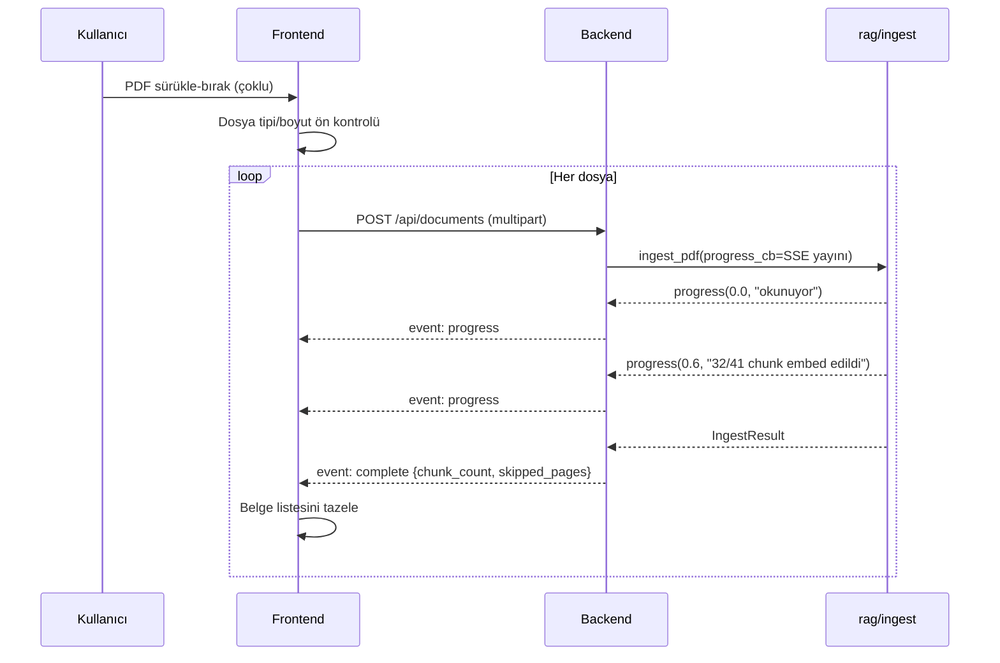
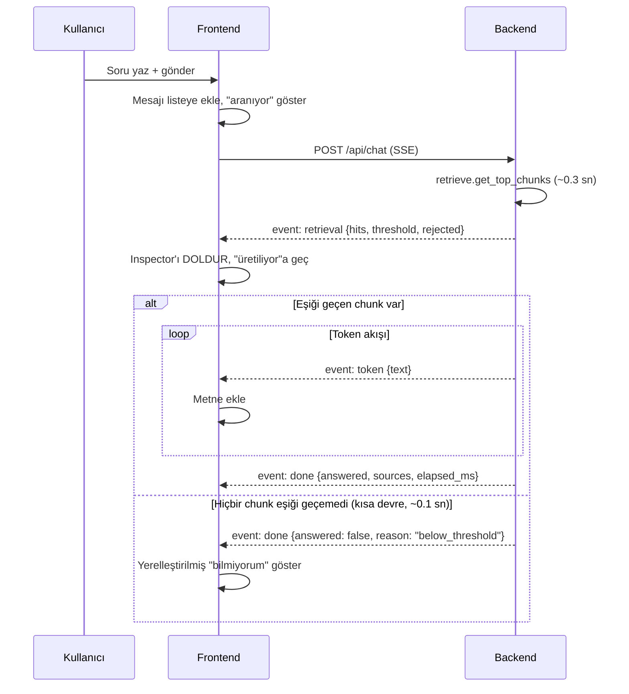
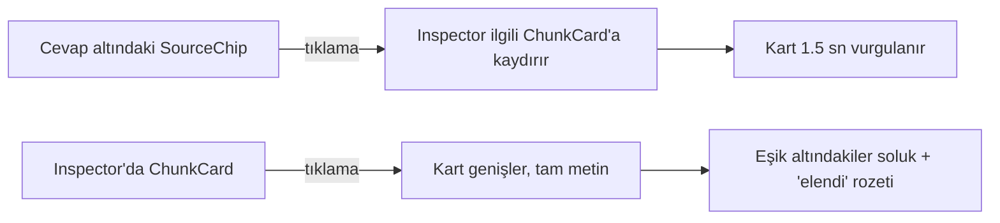
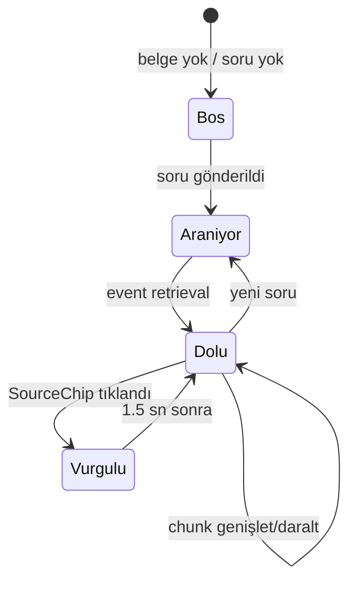

# Feature Spec — Local RAG Assistant v2

> **Bu doküman ikinci sözleşmedir.** Faz 4'te `backend-api` ve üç frontend
> agent'ı buna **paralel** çalışacak. Sonradan değişirse iki taraf birden bozulur.
>
> Faz 2 (`DESIGN_SYSTEM.md`) "neye benzeyecek", bu doküman "nasıl davranacak"
> sorusunu cevaplar.

---

## 0. Motor sözleşmesi (değişmeyecek)

Backend bu imzaları sarar, **değiştirmez**:

```python
store.connect(db_path=None) -> Connection
store.list_documents(conn) -> list[{filename, page_count, chunk_count, ingested_at}]
store.delete_document(conn, filename) -> bool
store.clear_cache() -> None

ingest.ingest_pdf(source, filename, conn, ocr, progress_cb) -> IngestResult
    # ProgressCb = Callable[[float, str], None]  -> (0.0-1.0, aşama metni)
    # IngestResult(filename, page_count, chunk_count, skipped_pages)

retrieve.get_top_chunks(query, k, min_score, conn) -> list[Hit]
    # Hit(score, source, page, content, via_ocr) + .citation()
    # DİKKAT: min_score varsayılanı None'dır ve None = FİLTRELEME YOK.
    # config.MIN_SCORE otomatik uygulanmaz. Bkz. bölüm 0.1.

answer.answer_query(question, k, min_score, model, conn) -> Answer
    # Answer(text, hits, answered) + .sources
```

### 0.1 `min_score` tuzağı — backend'in uyması ZORUNLU

`get_top_chunks`'un `min_score` parametresi **opt-in**'dir; varsayılanı `None`
ve `None` "filtreleme yok" demektir, "config varsayılanını kullan" demek
**değildir**. Ölçüldü:

```
get_top_chunks("İstanbul nüfusu kaçtır")           -> 4 chunk (skorlar 0.23-0.28)
get_top_chunks("...", min_score=config.MIN_SCORE)  -> 0 chunk   <- doğru davranış
```

Uçtan uca akış bugün doğru çalışıyor çünkü `answer.answer_query` varsayılanı
**kendisi çözüyor**:

```python
min_score = config.MIN_SCORE if min_score is None else min_score
```

Backend aynı sorumluluğu almalıdır:

| Endpoint | `min_score` değeri | Neden |
|---|---|---|
| `/api/chat` | `config.MIN_SCORE` (açıkça) | Kısa devre çalışmalı |
| `/api/retrieve` | `None` (açıkça, kasıtlı) | Inspector elenenleri de göstermeli |

> [!danger] Bu tuzak sessiz bozulur
> `min_score` unutulursa hata alınmaz; sistem sadece alakasız chunk'ları LLM'e
> göndermeye başlar ve "bilmiyorum" davranışı kaybolur. `backend-api` agent'ının
> testleri bu iki durumu **ayrı ayrı** doğrulamalıdır.
>
> Motor bu fazda değiştirilmiyor (`eval/run_eval.py` mevcut davranışa bağlı);
> sözleşme dokümanla bağlanıyor.

**Tek eklenecek fonksiyon** (Faz 4.7.1, mevcut `answer_query` dokunulmaz —
`eval/run_eval.py` ona bağlı):

```python
answer.answer_query_stream(question, k, min_score, model, conn)
    -> Iterator[StreamEvent]     # retrieval -> token* -> done
```

---

## 1. User Flow'lar

### 1.1 Belge yükleme



**Hata dalları**
| Durum | Backend | Frontend |
|---|---|---|
| PDF bozuk/şifreli | `event: error` + `code=INVALID_PDF` | Kart kırmızı, mesaj gösterilir, diğer dosyalar devam eder |
| Hiç chunk çıkmadı | `code=NO_CONTENT` | "Belge boş veya tamamen taranmış" |
| Bazı sayfalar okunamadı | `event: complete` + `skipped_pages: [3,7]` | Uyarı rozeti + sayfa numaraları |
| Aynı dosya adı | Sessizce üzerine yazılır (`upsert_document`) | "Güncellendi" bilgisi |

> [!important] Yükleme sırasında sohbet kilitlenir
> Ingest embedding modelini kullanır; aynı anda soru sorulursa kuyruk oluşur.
> Frontend yükleme boyunca `ChatInput`'u devre dışı bırakır ve sebebini yazar.

### 1.2 Soru sorma (ana akış)



**Kritik zamanlama** (uçtan uca, gerçek modelle HTTP üzerinden ölçüldü):

| | Süre |
|---|---|
| `retrieval` olayı | **0.04 – 0.07 sn** |
| İlk `token` | **4.8 – 5.9 sn** |
| Toplam | 5.6 – 7.6 sn |

> [!warning] Önceki 0.74 sn'lik TTFT rakamı yanıltıcıydı — düzeltildi
> O ölçüm bağlamsız kısa bir prompt'la yapılmıştı. Gerçek RAG koşulunda
> system prompt 4 chunk'lık bağlam (~500 kelime) taşıyor ve prefill süresi
> baskın hale geliyor; TTFT ~5 sn'ye çıkıyor.
>
> Bunun UX sonucu önemli: **streaming'in kazancı sanıldığından küçük**
> (5.1 sn yerine 6.4 sn'de tam metin — yaklaşık 1.3 sn erken görüntü).
> Asıl kazanç **Inspector'ın 0.05 sn'de dolması**: kullanıcı LLM'i beklerken
> hangi kaynakların bulunduğunu neredeyse anında görüyor. Bu yüzden
> `retrieval` olayının LLM'den önce gitmesi tasarımın en değerli parçası.

### 1.3 Kaynak inceleme



### 1.4 Belge silme

Onay diyaloğu → `DELETE /api/documents/{filename}` → `store.delete_document`
(CASCADE ile chunk'lar da gider) → `store.clear_cache()` → liste tazelenir.
Son belge silinirse sohbet boş duruma döner ve girdi kilitlenir.

### 1.5 Metrics görüntüleme

`GET /api/metrics` → önceden üretilmiş `eval/results.json` servis edilir.
**Eval istek anında çalıştırılmaz** (~100 sn sürer ve chat modeliyle çakışır).

---

## 2. REST Endpoint Sözleşmesi

| Metot | Yol | Amaç | Yanıt |
|---|---|---|---|
| `GET` | `/api/health` | Model durumu, config değerleri | `HealthResponse` |
| `GET` | `/api/documents` | Belge listesi | `list[DocumentInfo]` |
| `POST` | `/api/documents` | PDF yükle | **SSE** (`progress`/`complete`/`error`) |
| `DELETE` | `/api/documents/{filename}` | Belge sil | `{deleted: bool}` |
| `POST` | `/api/chat` | Soru sor | **SSE** (`retrieval`/`token`/`done`/`error`) |
| `POST` | `/api/retrieve` | Yalnızca retrieval (LLM'siz) | `RetrieveResponse` |
| `GET` | `/api/metrics` | Değerlendirme sonuçları | `MetricsResponse` |

### 2.1 Şemalar

```python
class HealthResponse(BaseModel):
    status: Literal["ready", "warming", "error"]
    chat_model: str            # "qwen2.5-7b"
    embedding_model: str       # "qwen3-embedding-0.6b"
    min_score: float           # 0.45  <- UI eşiği BURADAN alır
    top_k: int                 # 4
    document_count: int
    chunk_count: int
    ocr_available: bool

class DocumentInfo(BaseModel):
    filename: str
    page_count: int
    chunk_count: int
    ingested_at: str           # ISO 8601
    has_ocr_chunks: bool       # OCR rozeti için — TÜRETİLİR, bkz. aşağı

class ChunkHit(BaseModel):
    score: float
    source: str
    page: int                  # 0 = markdown fixture (sayfa yok)
    content: str
    via_ocr: bool
    citation: str              # "[Kaynak: dosya.pdf s.4]"
    passed_threshold: bool     # score >= min_score

class RetrieveResponse(BaseModel):
    hits: list[ChunkHit]       # eşik altındakiler DAHİL (Inspector göstersin)
    threshold: float
    elapsed_ms: int
```

> [!warning] `has_ocr_chunks` motorda yok, backend türetir
> `store.list_documents()` yalnızca `filename, page_count, chunk_count,
> ingested_at` döndürür. `rag/` değiştirilmeyeceği için backend ek bir sorgu
> çalıştırır (doğrulandı — `chunks.via_ocr` sütunu mevcut):
>
> ```sql
> SELECT source, SUM(via_ocr) > 0 AS has_ocr
> FROM chunks GROUP BY source
> ```
>
> Sonuç `list_documents()` çıktısıyla `filename`/`source` üzerinden
> birleştirilir. Bu, motoru değiştirmeden UI ihtiyacını karşılamanın doğru
> yolu; `store.py`'ye alan eklemek `eval/run_eval.py` ve `streamlit_app.py`'yi
> de etkilerdi.

> [!note] `/api/retrieve` eşik altındakileri de döndürür
> `retrieve.get_top_chunks(min_score=None)` ile çağrılır, eleme frontend'de
> `passed_threshold` bayrağıyla **görsel** olarak yapılır. Kullanıcı "neyin
> neden elendiğini" görebilmeli — açıklanabilirliğin özü bu.

### 2.2 Hata kodları

| HTTP | `code` | Ne zaman |
|---|---|---|
| 400 | `EMPTY_QUERY` | Soru boş |
| 400 | `INVALID_PDF` | pypdf açamadı / şifreli |
| 404 | `DOCUMENT_NOT_FOUND` | Silinecek belge yok |
| 409 | `NO_DOCUMENTS` | Korpus boş, soru sorulamaz |
| 413 | `FILE_TOO_LARGE` | Yapılandırılmış sınır aşıldı |
| 422 | `NO_CONTENT` | PDF'ten hiç chunk çıkmadı |
| 503 | `MODEL_WARMING` | Modeller henüz yüklenmedi |
| 500 | `INTERNAL` | Beklenmeyen |

---

## 3. SSE Olay Şeması

### 3.1 `/api/chat`

**Sıralama garantisi:** `retrieval` **her zaman** ilk olaydır. `token`
olayları yalnızca eşiği geçen chunk varsa gelir. `done` **her zaman** son
olaydır (hata hariç).

```
event: retrieval
data: {"hits": [ChunkHit...], "threshold": 0.45,
       "passed_count": 3, "rejected_count": 1, "elapsed_ms": 312}

event: token
data: {"text": "RAG üç"}

event: done
data: {"answered": true, "reason": null,
       "sources": ["[Kaynak: belge_01_rag_nedir.md]"],
       "elapsed_ms": 3090, "token_count": 51}

event: error
data: {"code": "INTERNAL", "message": "..."}
```

### 3.2 `reason` alanı — üç sonuç

| `reason` | `answered` | Token aktı mı | Frontend davranışı |
|---|---|---|---|
| `null` | `true` | Evet | Akan metni bırak, kaynakları göster |
| `below_threshold` | `false` | **Hayır** | Kendi yerelleştirilmiş metnini bas (~0.1 sn) |
| `llm_refused` | `false` | Evet | Akan metni **yerelleştirilmiş metinle değiştir**, kaynak gösterme |

> [!warning] `llm_refused` neden metni değiştiriyor?
> Reddetme metni (`NO_ANSWER_TEXT`) LLM'in system prompt'una gömülüdür ve
> model onu **Türkçe** üretir. UI dili İngilizce iken ham Türkçe metin basmak
> tutarsız olur. Akış sırasında modelin gerçek çıktısı gösterilir (dürüst),
> `done` gelince `chat.noAnswer` anahtarıyla değiştirilir. Metin ~5 kelime
> olduğu için görsel sıçrama ihmal edilebilir.

### 3.3 Streaming guard'ları — zorunlu

```python
for chunk in client.complete_streaming_chat(messages):
    if not chunk.choices:      # ÖLÇÜLDÜ: 51 parçada 1 boş chunk geliyor
        continue               # bu satır olmadan IndexError
    content = chunk.choices[0].delta.content
    if content:
        yield content
```

Bu guard'ın **testi yazılmalıdır** (boş chunk içeren sahte akış).

### 3.4 `/api/documents` yükleme akışı

```
event: progress
data: {"pct": 0.6, "stage": "32/41 chunk embed edildi"}

event: complete
data: {"filename": "rapor.pdf", "page_count": 13, "chunk_count": 41,
       "skipped_pages": [3, 7]}

event: error
data: {"code": "INVALID_PDF", "message": "..."}
```

`progress_cb(pct, stage)` doğrudan bu olaya eşlenir — motorda değişiklik yok.

> [!note] Tek POST hem yükleme hem SSE
> Standart yol iki adımdır (POST → job_id → GET SSE). Tek kullanıcılı yerel
> uygulamada tek `POST` + `StreamingResponse` yeterli ve daha basit.
> Bedeli: yükleme sırasında sayfa yenilenirse ilerleme takibi kopar — ingest
> arka planda tamamlanır, liste tazelendiğinde belge görünür.

---

## 4. Inspector Etkileşim Modeli

### 4.1 Durum makinesi



### 4.2 ChunkCard anatomisi

| Öğe | Kaynak | Kural |
|---|---|---|
| Skor rozeti | `hit.score` | Renk + sayı + ikon (üçü birlikte) |
| İlgi çubuğu | `hit.score` | Genişlik = skor, 0–1 aralığında |
| Kaynak | `hit.source` | Dosya adı, uzun ise ortadan kısaltılır |
| Sayfa | `hit.page` | `page > 0` ise "s.4", değilse gizli |
| OCR rozeti | `hit.via_ocr` | Varsa `--ocr-badge` rengiyle |
| Önizleme | `hit.content` | 3 satır, tıklayınca tam metin |
| Elendi durumu | `!hit.passed_threshold` | %50 opaklık + "elendi" rozeti |

### 4.3 Eşik çizgisi

Kartlar skora göre azalan sıralanır. `passed_threshold` `true`→`false`
geçişinin olduğu yere yatay bir ayırıcı çizilir:

```
──────── eşik 0.45 ────────
```

Eşik değeri `/api/health`'ten gelir, **koda gömülmez**.

Hiçbir chunk elenmemişse çizgi çizilmez. Hepsi elenmişse çizgi en üstte olur
ve panel başında "Hiçbir bölüm eşiği geçemedi" açıklaması görünür.

---

## 5. Durum Matrisi

| Durum | Sidebar | Chat | Inspector |
|---|---|---|---|
| Modeller yükleniyor | İskelet + "hazırlanıyor" | Girdi kilitli | Boş |
| Belge yok | Boş durum + yükleme çağrısı | Boş durum, girdi kilitli | Boş |
| Belge var, soru yok | Liste | Örnek soru önerileri | "Soru sorun" |
| Yükleme sürüyor | İlerleme çubuğu | **Girdi kilitli** + sebep | Değişmez |
| Soru işleniyor | Normal | "Aranıyor" → "Üretiliyor" | İskelet → dolu |
| Cevap hazır | Normal | Metin + kaynaklar | Chunk kartları |
| Eşik altı (kısa devre) | Normal | Yerelleştirilmiş "bilmiyorum" | Tüm kartlar soluk + açıklama |
| LLM reddetti | Normal | Yerelleştirilmiş metin, kaynak yok | Kartlar normal (bulundu ama yetmedi) |
| Ağ/sunucu hatası | Normal | Hata kartı + "tekrar dene" | Son durum korunur |
| Akış ortasında hata | Normal | **Kısmi metin korunur** + hata satırı | Son durum korunur |

> [!tip] Kısmi metin neden korunuyor?
> Akış 3 sn sürüyor; 2. saniyede kopan bir bağlantıda üretilen metni silmek
> kullanıcının işini kaybettirir. Kısmi metin gri bir "yanıt tamamlanamadı"
> satırıyla birlikte bırakılır.

---

## 6. Metrics Veri Sözleşmesi

### 6.1 Kalıcılaştırma sorunu

`eval/run_eval.py` şu an sonuçları **yalnızca yazdırıyor**. `/api/metrics`
için yapısal çıktı gerekiyor.

**Faz 4 görevleri (bana ait — modele dokunur):**

| # | Görev | Çıktı |
|---|---|---|
| M1 | `run_eval.py`'ye `--json <yol>` bayrağı ekle (additive, mevcut davranış korunur) | Kod |
| M2 | `--sweep-threshold --json` ile eşik taramasını kalıcılaştır | Kod |
| M3 | `qwen2.5-7b` ile tam eval çalıştır | `eval/results.json` |
| M4 | `phi-4-mini` ile tam eval çalıştır (model kıyası için) | Aynı dosyaya `models[]` girdisi |

> [!danger] Model kıyası şu an kayıtlı değil
> phi-4-mini'nin başarısız olduğu ölçüm oturum içinde yapıldı ama hiçbir
> dosyaya yazılmadı. Metrics sayfasında gösterilecekse **yeniden çalıştırılıp
> kalıcılaştırılmalı** — aksi halde koda gömülmüş bir iddia olur.
> `metrics-ui` agent'ının başarı kriteri bunu yasaklıyor.

### 6.2 `eval/results.json` şeması

```jsonc
{
  "generated_at": "2026-08-13T15:00:00+03:00",
  "config": { "min_score": 0.45, "top_k": 4,
              "chunk_words": 130, "chunk_overlap_words": 30 },
  "corpus": { "chunk_count": 17, "document_count": 6 },

  "models": [
    {
      "alias": "qwen2.5-7b",
      "model_id": "qwen2.5-7b-instruct-generic-gpu:4",
      "is_active": true,
      "summary": { "passed": 15, "total": 15,
                   "by_category": { "answerable": [10,10],
                                    "unanswerable": [3,3],
                                    "edge_case": [2,2] },
                   "retrieval_hits": [10,10],
                   "avg_seconds": 6.6 },
      "questions": [
        { "id": "Q01", "category": "answerable", "passed": true,
          "seconds": 24.1, "expected_source": "belge_01_rag_nedir.md",
          "source_found": true, "keywords_matched": 3, "keywords_total": 3,
          "answer": "RAG üç adımdan oluşur: ..." }
      ]
    }
  ],

  "threshold_sweep": {
    "answerable_scores": [0.7828, 0.7290, "..."],
    "other_scores": [0.7359, 0.5068, "..."],
    "table": [ { "threshold": 0.45, "answerable_passed": 10,
                 "answerable_total": 10, "other_passed": 3, "other_total": 4 } ]
  }
}
```

### 6.3 `MetricsResponse`

`/api/metrics` bu dosyayı doğrudan servis eder. Dosya yoksa `503` +
`code=METRICS_NOT_GENERATED` döner; UI "değerlendirme henüz çalıştırılmadı"
gösterir — **sahte sayı göstermez**.

### 6.4 Metrics UI'ın anlatması gereken içgörü

Eşik grafiği yalnızca sayı göstermemeli; projenin en önemli teknik bulgusunu
görselleştirmeli: **cevaplanabilir (0.65–0.84) ve cevaplanamaz (0.43–0.74)
grupları örtüşüyor.** Tek eşik ikisini ayıramaz; bu yüzden savunma iki
katmanlı. Örtüşme bölgesi grafikte açıkça işaretlenmeli.

---

## 7. Eşzamanlılık ve Warmup

**Kilit:** Tüm model çağrıları (`ingest`, `chat`, `retrieve`) tek bir
`asyncio.Lock` arkasında serileştirilir. Foundry Local runtime'ının eşzamanlı
istek davranışı **doğrulandı** (Faz 4.7): iki paralel istek gerçek modelle,
HTTP üzerinden test edildi ve ikisi de temiz tamamlandı; süreler (5.67 sn ve
13.31 sn) kilidin serileştirdiğini gösteriyor — paralel çalışsalardı ikisi de
~6 sn'de biterdi.

**Warmup:** FastAPI `lifespan` içinde `models.get_embedding_client()` ve
`models.get_chat_client()` çağrılır (~6.4 GB, ilk açılışta uzun). Bu sürede
`/api/health` `status: "warming"` döner; UI girdiyi kilitler ve durumu yazar.

**Kuyruk görünürlüğü:** Kilit tutulduğunda bekleyen istek `503 MODEL_WARMING`
almaz — bekler. Frontend 30 sn'lik bir timeout ile "sistem meşgul" gösterir.

---

## 8. Faz 3 Tamamlanma Kriterleri

- [x] Beş user flow adım adım yazılı (yükleme, soru, kaynak inceleme, silme, metrics)
- [x] Her endpoint için istek/yanıt şeması + hata kodları
- [x] SSE olay tipleri alan alan tanımlı, sıralama garantisi yazılı
- [x] Inspector etkileşim modeli + eşik çizgisi davranışı
- [x] Boş/hata/yükleniyor durum matrisi
- [x] Metrics veri sözleşmesi + kalıcılaştırma görevleri tanımlı

**Dondurulan:** endpoint yolları, şema alan adları, SSE olay adları ve
`reason` değerleri, hata kodları.
